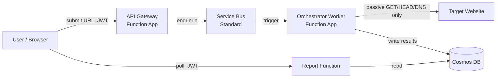

# BRAVO6

**Passive, external security scanning for sites that can't safely take an active scan.**

If you (or an AI coding assistant) shipped a site fast and it's now sitting on a public URL with
no formal security review behind it, you're in a bad spot for the usual tools: OWASP ZAP, Burp
Suite, and Nikto all assume an operator with standing authorization to inject payloads, brute-force
paths, and throw thousands of signature probes at a target. If you don't have that authorization —
or you're a third party checking a site you don't operate — pointing an active scanner at it risks
doing real, unauthorized harm while you're trying to find out whether it's safe.

BRAVO6 takes a different, narrower approach: it never injects a payload, never attempts an auth
bypass, and never sends anything beyond a `GET`, `HEAD`, `OPTIONS`, or DNS lookup — the same
traffic a browser page load already generates. That's a real trade — categories like blind SQLi or
triggered stored XSS are permanently out of reach — but it means the tool is safe to point at a
target you don't control the authorization boundary of, which is the exact situation this project's
users are usually in.

This is one output of a graduation research project; the accompanying paper (`main.pdf`, repo root)
covers the design rationale, an empirical evaluation against 500 live domains, and an honest
accounting of what's implemented versus designed-only. This README is the developer-facing version
of the same information.

---

## The ten scouts

Every scan runs all ten as independent, concurrently-executed plugins (`asyncio.gather`) against the
same target, then normalizes and scores the combined findings as one pass.

| # | Scout | Checks |
|---|---|---|
| 01 | Secrets Hunter | Exposed API keys/credentials in served HTML/JS, entropy-filtered |
| 02 | Frontend Library Detection | Known-vulnerable JS libraries, CVE-matched against a version string |
| 03 | Cookie Security | Missing `HttpOnly` / `Secure` / `SameSite` |
| 04 | SSL/TLS Health | Certificate, protocol, cipher configuration, OCSP stapling |
| 05 | Security Headers | Missing CSP, HSTS, Referrer-Policy, etc. |
| 06 | Information Disclosure | Exposed sensitive paths, soft-404-aware |
| 07 | Email Security | SPF, DKIM, DMARC, MTA-STS, BIMI misconfiguration |
| 08 | CORS Misconfiguration | Wildcard-plus-credentials, origin reflection |
| 09 | Subresource Integrity | Missing/unenforced SRI on cross-origin `<script>`/`<link>` tags |
| 10 | Hallucinated Dependency Detection | A manifest (`package.json`, `requirements.txt`) declaring a package that doesn't exist on its public registry — the exact failure mode where an AI assistant hallucinates a dependency name an attacker can later register and have installed verbatim |

Two more scouts (mixed-content scanning, an AI-exposure probe) exist as prototypes in
`future-work/code-scan/` but are not wired into the live pipeline.

## Implementation status

Honestly, not all of this is deployed. Six components exist end-to-end in Terraform; here's what's
actually running versus what's code-complete-but-idle versus what's spec-only:

| Component | Status |
|---|---|
| **Worker** (the scanner itself) | Deployed. Implements the full pipeline: plugin discovery, concurrent scout execution, normalization, deduplication, scoring. |
| **Ten scouts** | Implemented and wired into `discover_plugins()`. Currently **190 passing regression-test methods** across the ten `test_NN_*.py --test` suites, plus 33 in the Worker's own orchestration suite (`main_scanner.py --test`) — run them yourself, the numbers below are current as of this commit, not copied from anywhere. |
| **API Gateway** | Code-complete (JWT validation, blocklist, quota, Cosmos write + Service Bus enqueue) and covered by a 44-assertion regression suite against mocked Azure clients. **Not yet deployed or exercised against a live Function App, real Entra tokens, or real Service Bus traffic.** |
| **Message Queue** (Service Bus) | Infrastructure-provisioned via Terraform, not yet exercised end-to-end from a deployed Gateway through to a deployed Worker. |
| **Reports function** | Infrastructure-provisioned; read path implemented. |
| **Frontend** | Designed and specified only. No implementation code exists yet. |

If a claim above looks stale by the time you read it, trust `git log` and the test suites over this
file — they're both one command away and this paragraph isn't.

## Quickstart

Each scout is a standalone, runnable module — you don't need the full Azure stack to try the scanner
locally.

```bash
git clone https://github.com/amramer101/Graduation-Project-Bravo6.git
cd Graduation-Project-Bravo6/src/worker
pip install -r requirements.txt

# Run every scout's own regression suite
for f in test_*.py; do python3 "$f" --test; done

# Run a real scan against a target you're authorized to check
python3 main_scanner.py --url https://example.com
```

See [`src/worker/README.md`](src/worker/README.md) for scout-level detail and
[`src/worker/evaluation/README.md`](src/worker/evaluation/README.md) for how the paper's n=500
evaluation batch was generated and reproduced.

To stand up the full Azure infrastructure:

```bash
cd terraform
cp terraform.tfvars.example terraform.tfvars   # fill in your own tenant ID, resource names
terraform init
terraform plan
terraform apply
```

`terraform.tfvars` is gitignored — it will hold your subscription/tenant identifiers once you fill
it in, and should never be committed.

## Architecture



Six loosely-coupled components on Azure, communicating through Managed-Identity-authenticated
channels rather than stored connection strings — designed to run near $0/month on consumption
billing and free-tier allowances. Full detail, including the CQRS split between the write path
(submission → queue → scan) and the read path (poll → report), the identity/RBAC matrix, and the
Architecture Decision Records, is in the [docs site](#documentation) and in `main.pdf`.

## Documentation

Full architecture, infrastructure-as-code reference, security/identity model, cost model, and
CI/CD documentation: **[docs site link — filled in once GitHub Pages deploys, see below]**

The full paper (`main.pdf` at the repo root) covers the empirical evaluation (n=500 live domains),
related-work comparison against existing passive scanners, and the Architecture Decision Records in
depth. **Open item for the author:** the paper's own placeholder author/affiliation fields and any
GitHub/doc URLs inside it should be updated to point back at this repository before or shortly after
it goes public.

## Contributing / testing

Each scout is its own file and its own `unittest`-based regression suite — run
`python3 test_NN_*.py --test` for any single scout, or see
[`.github/workflows/python-tests.yml`](.github/workflows/python-tests.yml) for how CI runs the full
set. There's no `CONTRIBUTING.md` yet; open an issue or PR and it'll get a response.

## License

**No license file exists in this repository yet.** Until one is added, default copyright applies —
nobody else has permission to reuse, modify, or redistribute this code, even though the repository
is publicly visible. Choosing a license (MIT, Apache-2.0, or otherwise) is an open decision for the
author, not something this pass invents on your behalf.

## Author

Amr Medhat Amer — Faculty of Computer and Data Science, Alexandria University.
