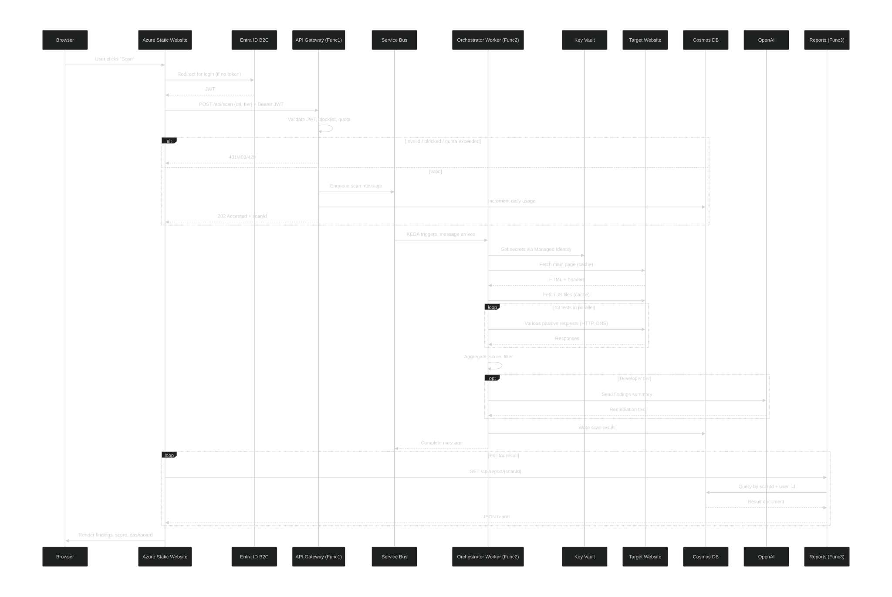

# BRAVO6

**The Silent Guardian of the AI Coding Era**

---

> *Modern development is fast. AI assistants generate code in seconds. But every generated line can hide a secret, a weak configuration, or an outdated library — Security Debt that no one reviews. BRAVO6 was built to solve that.*

---

## Table of Contents

1. [The Problem We Solve](#1-the-problem-we-solve)
2. [Architecture at a Glance](#2-architecture-at-a-glance)
3. [Why This Architecture — The Industry Standard](#3-why-this-architecture--the-industry-standard)
4. [System Flow — From Click to Report](#4-system-flow--from-click-to-report)
5. [The Caching Engine — Why We Are 5x Faster](#5-the-caching-engine--why-we-are-5x-faster)
6. [Component Deep Dive](#6-component-deep-dive)
   - [The Frontend](#61-the-frontend)
   - [The API Gateway — The Gatekeeper](#62-the-api-gateway--the-gatekeeper)
   - [The Service Bus and KEDA Autoscaling](#63-the-service-bus-and-keda-autoscaling)
   - [The Orchestrator Worker — The Brain](#64-the-orchestrator-worker--the-brain)
   - [Reports and Analytics](#65-reports-and-analytics)
7. [The 13 Scouts — Full Algorithmic Breakdown](#7-the-13-scouts--full-algorithmic-breakdown)
8. [Error Handling and Resilience](#8-error-handling-and-resilience)
9. [Security and Compliance](#9-security-and-compliance)
10. [Observability](#10-observability)
11. [Core Design Decisions](#11-core-design-decisions)
12. [Team](#12-team)

---

## 1. The Problem We Solve

The rise of AI-assisted coding — Copilot, ChatGPT, Claude — has made developers dramatically faster. Entire applications are now scaffolded in minutes. What these tools do not solve is the security layer. A model trained to write functional code will produce functional code; it will not necessarily produce *secure* code.

The result is a new class of vulnerability we call **AI Security Debt**: hardcoded secrets embedded in auto-generated JavaScript, outdated library versions suggested from stale training data, missing security headers on generated API responses, and misconfigured CORS policies that feel correct until an attacker exploits them.

Traditional scanners attack the problem by attacking the target — sending payloads, brute-forcing paths, and triggering IDS alerts. That approach is noisy, destructive in CI/CD environments, and illegal without explicit permission.

**BRAVO6 is different.** It is a passive, read-only security scanner. It behaves exactly like a browser. It sends no payloads. It triggers no alarms. It reads what is publicly visible and tells you what an attacker would see — before the attacker sees it.

Thirteen specialized tests run in full concurrency. A complete scan of any live target finishes in approximately 30 seconds. Every finding is contextualized, deduplicated, and scored. Developer-tier users receive AI-generated remediation instructions tailored to their exact configuration.

The platform runs entirely on Microsoft Azure, is fully serverless, costs nothing at idle, and scales automatically to thousands of simultaneous scans.

---

## 2. Architecture at a Glance

BRAVO6 is a six-component event-driven serverless platform. The diagram below shows how each component relates to the others.

*The component map. Every connection is unidirectional and authenticated. No component has direct access to another's secrets.*

**The six components:**

| Component | Technology | Responsibility |
|-----------|-----------|---------------|
| Frontend | Azure Static Website (React SPA) | User interface, authentication, result polling |
| API Gateway | Azure Function App 1 | JWT validation, blocklist, quota, enqueue |
| Message Queue | Azure Service Bus | Durable buffer between gateway and worker |
| Orchestrator Worker | Azure Function App 2 | Scanning engine, caching, test orchestration |
| Data Layer | Azure Cosmos DB (Serverless) | Scan results, user quotas, analytics |
| Reports | Azure Function App 3 | Authenticated data access, analytics aggregation |

Supporting infrastructure: **Azure Key Vault** holds all secrets, accessed by workers via Managed Identity — no credentials in code. **Entra ID B2C** handles authentication, MFA, and social logins, issuing the JWTs that flow through every request.

---

## 3. Why This Architecture — The Industry Standard

The combination of serverless compute and event-driven messaging is not a trend. It is the architecture that powers Netflix, Meta, Uber, and every modern cloud-native platform at scale. Understanding why requires understanding the two core problems it solves.

**Problem 1: The idle cost trap.**
A traditional server-based architecture runs continuously, whether it serves one request per second or ten thousand. BRAVO6 has unpredictable traffic — scans arrive in bursts during working hours and the platform is silent at night. A server-based design would pay for 24 hours of compute to serve 4 hours of actual work. Serverless Functions cost nothing when idle and spin up in milliseconds when a request arrives. This is not a micro-optimization; at scale, it is the difference between a viable business and a money pit.

**Problem 2: The synchronous wall.**
A security scan takes approximately 30 seconds. If the API waited synchronously for the scan to complete before responding to the user, every HTTP request would hold a connection open for half a minute. Under modest load — say 50 concurrent users — that is 50 open connections, each blocking. A single slow target would cascade into timeouts. This is how traditional tools break.

The solution, used by Netflix for video processing, Meta for feed generation, and Uber for trip dispatch, is the **event-driven decoupling pattern**: the API responds immediately with an acknowledgment and a tracking ID, pushes the heavy work to a queue, and lets a worker process it asynchronously. The user gets a sub-200ms response. The worker gets the full 30 seconds it needs. The queue absorbs traffic spikes without dropping a single message.

**BRAVO6 applies both principles simultaneously.** The API Gateway is a serverless function that responds in under 200 milliseconds. The Orchestrator Worker is a serverless function triggered by the queue, autoscaled by KEDA based on queue depth. The result is a system that can handle one scan or one thousand scans with identical architecture, identical reliability, and zero idle cost.

---

## 4. System Flow — From Click to Report

The sequence diagram below shows the complete lifecycle of a single scan request, from the user clicking "Scan" to the report rendering in the browser.

*The full system choreography. Note the asynchronous boundary at the Service Bus — this is where the synchronous user experience ends and the background processing begins.*

**Phase 1 — The Gatekeeper (< 200ms):**

The user submits a URL. The API Gateway validates the JWT, checks the target against the blocklist, enforces the daily quota, pushes a message to the Service Bus queue, and returns a `202 Accepted` with a scan ID. The user never waits for the scan.

**Phase 2 — The Queue (< 1 second delivery):**

The Service Bus holds the message durably. If the worker is busy, the message waits. If the worker crashes, the message is not lost — it retries up to three times before landing in a dead-letter queue. The queue is the guarantee that no scan is ever dropped.

**Phase 3 — The Scan (~30 seconds):**

KEDA detects the message and triggers a worker instance. The worker retrieves secrets from Key Vault, fetches the target's main page and all JavaScript files once (caching everything), then fires all 13 tests concurrently. When complete, it writes the full report to Cosmos DB and marks the queue message as processed.

**Phase 4 — The Report (polling every 2 seconds):**

The frontend polls the Reports API. The moment the result document appears in Cosmos DB, the Reports function returns it and the frontend renders the findings, security score, and remediation guidance.

**Total time from click to report: approximately 32 seconds for any target on earth.**

---

## 5. The Caching Engine — Why We Are 5x Faster

The most important performance decision in BRAVO6 is not concurrency. It is caching.

Without caching, a naive implementation of 13 tests would fetch the target's main HTML page once per test that needs it — potentially 8 or 9 fetches of the same document. Each JavaScript file would be downloaded multiple times across tests that inspect client-side code. For a typical site with 15 JavaScript files, that naive approach generates over 100 network requests per scan. At average network latency, that is 3 to 5 minutes of I/O-bound waiting.

BRAVO6 fetches the main page exactly once. It fetches each JavaScript file exactly once. Everything is stored in a `ScanContext` object that is passed to every test. The 13 tests then read from memory, not the network.

*The caching pipeline. One network fetch per resource. All 13 tests read from shared memory.*

**The mechanism:**

Before any test begins, the Orchestrator creates a `ScanContext` that contains four things: a shared HTTP client session (connection pooling eliminates TCP handshake overhead), the full HTML of the main page, a dictionary of JavaScript file contents keyed by URL, and the HTTP response headers. Building this context requires one HTTP request plus one request per unique JavaScript file — typically 5 to 20 total requests.

After context initialization, all 13 tests run concurrently using Python's async I/O model. Tests that need HTML read `ctx.main_page_html`. Tests that need JavaScript read `ctx.js_files`. Tests that need DNS records or TLS certificates make their own lightweight I/O calls, which run in parallel with everything else.

The reduction in network I/O exceeds 70%. The total scan time drops from potential minutes to approximately 30 seconds. This is not an academic optimization — it is what makes BRAVO6 usable in a developer workflow where waiting three minutes for a security scan is a dealbreaker.

---

## 6. Component Deep Dive

### 6.1 The Frontend

The frontend is a React single-page application hosted on Azure's static website feature. It is purely client-side rendered — no server, no backend rendering, zero hosting cost beyond storage bandwidth.

Authentication is handled by the Microsoft Authentication Library (MSAL). Users are redirected to Entra ID B2C for login. The resulting JWT is held in memory (never persisted to localStorage or cookies) and attached as a Bearer token to every API request.

The frontend has no direct access to any database. All data flows through the two Function Apps it communicates with: the API Gateway for submitting scans and the Reports function for reading results. This is a deliberate security boundary — even if someone extracted the frontend's build artifacts, they would find no credentials, no connection strings, no direct data access.

After submitting a scan, the frontend polls the Reports API every two seconds. The moment the result document is available, it stops polling and renders the findings.

### 6.2 The API Gateway — The Gatekeeper

The API Gateway is a single HTTP-triggered function that processes `POST /api/scan`. It is the sole public entry point into the scanning system. Everything it does is synchronous and completes in under 200 milliseconds.

*The complete system flow with the Gatekeeper's three-stage validation highlighted: JWT check, blocklist check, and quota check — all before a single byte of scan work begins.*

**The five sequential steps:**

**Step 1 — JWT Validation.** The function extracts the Authorization header and validates the token against Entra ID B2C's public signing keys. It checks the signature, expiration, and extracts the `sub` claim (the user's unique identifier). Any failure returns an immediate `401 Unauthorized`. No further processing occurs.

**Step 2 — Target Normalization and Validation.** The submitted URL is lowercased, stripped of trailing slashes, and validated for proper format. Invalid URLs return `400 Bad Request`.

**Step 3 — Global Blocklist Check.** The target domain and its resolved IP are compared against a hardcoded list of protected domains: government (.gov, .mil), financial institutions, healthcare providers, and critical infrastructure. This list is compiled directly into the function's code — it is not configurable, not database-driven, not overridable by any API parameter. If the target matches, the function returns `403 Forbidden`. No queue message is sent.

**Step 4 — Daily Quota Enforcement.** The function queries Cosmos DB for the user's scan count for the current UTC day. Free-tier users are allowed 2 scans per day; Developer-tier users are allowed 10. If the limit is reached, the function returns `429 Too Many Requests` with a `Retry-After` header pointing to midnight UTC. No queue message is sent and the counter is not incremented.

**Step 5 — Enqueue and Acknowledge.** If all checks pass, the Gateway assembles a small JSON message containing the user ID, target URL, and tier. It pushes the message to the Service Bus queue and atomically increments the user's daily counter in Cosmos DB. It then returns `202 Accepted` with a scan ID. The entire operation — from receiving the request to sending the 202 — completes in under 200 milliseconds.

### 6.3 The Service Bus and KEDA Autoscaling

The Service Bus queue is the system's reliability guarantee. It is configured with a maximum delivery count of 3 — meaning a message can fail and be retried up to three times before being moved to a dead-letter queue for operator inspection.

The worker Function App uses **KEDA (Kubernetes Event-Driven Autoscaling)** to scale based on queue depth. The scaling rule: for every 5 messages waiting in the queue, spin up an additional worker instance. When the queue is empty, scale down to zero. This means the scanning capacity is always proportional to demand — no over-provisioning, no under-provisioning, no manual scaling decisions.

The queue also provides **load leveling**. If 500 users submit scans simultaneously, the Gateway enqueues all 500 messages instantly (all 500 users get their `202 Accepted` in under 200ms) and KEDA scales the worker fleet to process them. Without the queue, those 500 simultaneous HTTP connections would saturate the function and cause timeouts.

### 6.4 The Orchestrator Worker — The Brain

The Orchestrator Worker is where all actual security testing happens. It is a Service Bus-triggered Python function. Each invocation processes exactly one scan message.

**The lifecycle of one invocation:**

1. The Service Bus delivers a message. The function deserializes the payload (user ID, target URL, tier).
2. Using its system-assigned Managed Identity, the function authenticates to Azure Key Vault and retrieves the Cosmos DB connection string and the OpenAI API key. No secret is ever stored in environment variables, configuration files, or source code.
3. The scanning orchestrator is called. It builds the `ScanContext` (see Section 5), then fires all 13 test functions concurrently using `asyncio.gather` with `return_exceptions=True`. This last parameter is critical: it means an exception in any one test does not propagate and crash the entire scan. A test that fails due to a DNS timeout or connection reset simply returns an empty findings list. The other 12 tests continue unaffected.
4. When all tests complete, findings are flattened and the security score is calculated. The score starts at 100 and is reduced by weighted deductions: Critical findings subtract 15 points, High subtracts 10, Medium subtracts 5, Low subtracts 2, Informational subtracts 1. The score is clamped at zero.
5. If the user's tier is Developer and at least one finding was discovered, the worker sends a structured summary to OpenAI. The AI returns human-readable, actionable remediation instructions specific to the target's configuration. This adds approximately 2–3 seconds.
6. The complete report document — findings array, security score, AI remediation if generated, scan metadata — is written to Cosmos DB.
7. The Service Bus message is marked as complete and removed from the queue.

### 6.5 Reports and Analytics

The Reports function is a read-only data access layer. It exposes two endpoints. `GET /api/report/{scanId}` fetches a specific scan document, verifying that the requesting user's JWT `sub` matches the document's `userId` field — no user can read another user's results. `GET /api/dashboard` returns aggregated analytics for the authenticated user: scan history, average security score over time, and most common vulnerability categories.

This function contains no scanning logic whatsoever. Its only job is authenticated data retrieval with strict ownership enforcement.

---

## 7. The 13 Scouts — Full Algorithmic Breakdown

Every test behaves exactly like a standard browser. No exploit payloads. No brute-force. No traffic that would trigger a WAF or IDS. The techniques are GET, HEAD, OPTIONS, DNS TXT queries, and TLS handshakes — the same requests a browser makes on every page load.

| # | Scout | Category | Core Insight |
|---|-------|----------|-------------|
| 1 | Secrets Hunter | Code Analysis | Entropy + context filtering eliminates false positives |
| 2 | Frontend Libraries | Code Analysis | CVE signature verification prevents flagging unused vulnerable code |
| 3 | Mixed Content | Encryption | Parses cached HTML for HTTP resources on HTTPS pages |
| 4 | SSL/TLS Health | Encryption | Certificate validity, weak protocols, weak ciphers |
| 5 | Security Headers | Server Config | Context-aware severity: login forms elevate missing CSP to Critical |
| 6 | Information Disclosure | Server Config | Generic 403 baseline eliminates noise from catch-all rules |
| 7 | Cookie Security | Server Config | Flags HttpOnly, Secure, SameSite per cookie attribute |
| 8 | Email Security | DNS / OSINT | SPF, DKIM, DMARC — email spoofing prevention |
| 9 | Subdomain Takeover | DNS / OSINT | CNAME chain + service-specific error string detection |
| 10 | Robots.txt Analysis | DNS / OSINT | Dual User-Agent probing exposes weak access controls |
| 11 | CORS Misconfiguration | Advanced Config | Origin reflection + credentials header combination = Critical |
| 12 | Dangerous HTTP Methods | Advanced Config | PUT writability verification, TRACE echo test |
| 13 | CMS Fingerprinting | Advanced Config | Weighted evidence scoring across meta tags, headers, cookies, paths |

---

**Scout 1 — Secrets Hunter**

The test builds a combined text corpus from the cached main HTML and all cached JavaScript files. It then runs a curated set of regular expression patterns targeting known secret formats: AWS access keys (identifiable by the `AKIA` prefix), generic API key assignment patterns, Slack tokens, and others.

For each regex match, two filters run before a finding is reported. The **entropy filter** computes the Shannon entropy of the candidate string. Strings below an entropy threshold of approximately 3.5 bits per character are discarded — they represent placeholder text, human-readable identifiers, or common words rather than randomly generated secrets. Legitimate API keys have high entropy because they are randomly generated; words like "your_api_key_here" do not.

The **context window filter** examines the 50 characters surrounding each match. Words like "example," "test," "insert," or "placeholder" in the surrounding text indicate a documentation or template context — the finding is downgraded to informational. Words like "production," "secret," "password," or "token" indicate a live credential context — the finding is elevated.

For patterns tied to known services (AWS, GitHub), the test optionally performs **live verification**: a lightweight authenticated request to the service's verification endpoint. A successful response confirms the key is valid and the finding is marked Critical and Verified. An invalid key is still reported but marked Unverified with lower severity — the key may have been rotated but was still exposed in source code.

---

**Scout 2 — Frontend Libraries**

The test extracts library names and versions from three sources: script tag filenames (e.g., `jquery-3.4.1.min.js`), global JavaScript variables inspected through the cached source (e.g., `jQuery.fn.jquery`), and version strings embedded in library comments.

Each identified version is cross-referenced against an internal CVE database. For every matching CVE, the test retrieves the vulnerability's **signature** — the specific function name or code pattern that represents the vulnerable code path. It then searches the entire cached JavaScript corpus for that signature.

If the vulnerable function is not found in the code, the CVE is either suppressed or marked informational. This single step — signature verification — eliminates the majority of false positives that traditional scanners produce. A scanner that flags every jQuery 3.4.1 installation without checking whether the vulnerable function (`jQuery.htmlPrefilter`) is actually called will generate noise that developers learn to ignore. BRAVO6 only flags what is actually present and exploitable.

---

**Scout 3 — Mixed Content**

The test scans the cached main HTML for resource references that use `http://` on a page served over `https://`. Active mixed content — JavaScript and CSS loaded over HTTP — is blocked by modern browsers and represents a broken security model. Passive mixed content — images and iframes — may still load and represents a data integrity risk.

Form actions pointing to HTTP endpoints are flagged separately as they represent credential submission over an unencrypted channel. All findings are reported with the tag type, the insecure URL, and the location in the HTML.

---

**Scout 4 — SSL/TLS Health**

The test evaluates the target's TLS configuration across three dimensions.

**Certificate validation:** The X.509 certificate is retrieved and the chain is validated to a trusted root. The `notAfter` field is checked — expiry within 30 days is High severity, expiry already passed is Critical. Certificates signed with SHA-1 are flagged as weak. Self-signed certificates are reported.

**Protocol support:** The test attempts TLS handshakes using SSLv3, TLS 1.0, and TLS 1.1. If any handshake succeeds, the server is offering an obsolete protocol. TLS 1.0 and 1.1 were deprecated by all major browsers in 2020 and 2021 respectively.

**Cipher strength:** The negotiated cipher suite is compared against a list of known-weak algorithms: RC4, DES, 3DES, and export-grade ciphers. Weak ciphers are reported with the cipher name and a note on the specific weakness.

No active downgrade attacks are performed. The test only observes what the server willingly offers.

---

**Scout 5 — Security Headers**

The test reads the response headers stored in `ScanContext` and evaluates six headers:

`Strict-Transport-Security` must be present on HTTPS sites with a `max-age` of at least 15,724,800 seconds (6 months) and `includeSubDomains` set. Missing HSTS is High severity.

`Content-Security-Policy` must be present. Policies containing `unsafe-inline` or `unsafe-eval` directives are flagged as insufficiently restrictive. Absent CSP is High severity.

`X-Frame-Options` must be present to prevent clickjacking. `X-Content-Type-Options: nosniff` must be present to prevent MIME sniffing. `Referrer-Policy` must not be set to `unsafe-url`. `Permissions-Policy` is checked and absence is noted as informational.

**Context boost:** If the cached HTML contains a `<form>` element with a password input field, the severity of missing CSP and missing HSTS is elevated to Critical. A login page with no CSP is a substantially more dangerous configuration than a static marketing page with no CSP.

---

**Scout 6 — Information Disclosure**

The test detects accidentally exposed sensitive files. Its most important innovation is the **baseline comparison** that eliminates noise.

Before probing any sensitive path, the test sends a HEAD request to a guaranteed-nonexistent random path. The response status code and body hash are recorded as the "generic baseline" — the server's standard response for anything it does not know about.

The probe list covers common exposures: `.env`, `.git/HEAD`, `.git/config`, `wp-config.php.bak`, `backup.zip`, `database.sql`, and others. For each path, a HEAD (or range GET) request is sent. If the response is `200 OK`, it is a finding. If the response is `403 Forbidden`, the response body is compared to the baseline 403. If they match, the finding is suppressed — the server applies a catch-all rule to everything and the file likely does not exist. If the bodies differ significantly, the server is specifically restricting that path, which implies the file exists and is being protected — a lower-severity finding that informs the operator the file may exist even if it is not directly accessible.

This eliminates the large category of false positives where servers return 403 for every path that does not exist, which naive scanners incorrectly report as "forbidden sensitive file found."

---

**Scout 7 — Cookie Security**

The test parses every `Set-Cookie` header from the main page response. For each cookie, four attributes are evaluated independently.

**HttpOnly:** Absence means the cookie is accessible via JavaScript (`document.cookie`), making it stealable through any XSS vulnerability. Flagged as Medium.

**Secure:** Absence means the cookie is transmitted over unencrypted HTTP connections, where it can be intercepted. Flagged as High.

**SameSite:** `None` without the `Secure` attribute is Critical — it allows cross-site requests with credentials over unencrypted channels. Absent `SameSite` is Low (modern browsers default to `Lax`).

**Scope:** Cookies with an overly broad `Domain` attribute (e.g., `.example.com` on a subdomain) are noted, as they are accessible by all subdomains including potentially compromised ones.

Each cookie is reported individually, with each misconfiguration itemized.

---

**Scout 8 — Email Security**

Three DNS-based checks protect the domain from email spoofing.

**SPF (Sender Policy Framework):** A DNS TXT query retrieves the domain's SPF record. The record's mechanisms are parsed. `+all` means anyone can send email as this domain — Critical. `?all` (neutral) and `~all` (soft fail) are weak and flagged as Medium. `-all` (hard fail) is the correct configuration. Missing SPF is High.

**DMARC (Domain-based Message Authentication):** A DNS TXT query for `_dmarc.<domain>` retrieves the policy. `p=none` means the domain monitors but takes no action against spoofed emails — Low. `p=quarantine` sends suspicious emails to spam — Medium (acceptable). `p=reject` rejects spoofed emails entirely — the correct configuration. Missing DMARC is High.

**DKIM (DomainKeys Identified Mail):** Common selectors are probed (`google`, `selector1`, `default`, `mail`). If no DKIM record is found under any common selector, it is noted as Informational — DKIM may exist under an unknown selector. If a record is found with a weak key length (under 1024 bits), it is flagged as Medium.

---

**Scout 9 — Subdomain Takeover**

This test detects one of the most underappreciated attack vectors: dangling DNS records pointing to deleted cloud resources.

The CNAME chain for the target hostname is resolved to its terminal canonical name. This canonical name is compared against a list of cloud service domain patterns: Azure Websites, Azure CloudApp, AWS S3, AWS Elastic Beanstalk, Heroku, GitHub Pages, Fastly, and others.

If the canonical name matches a cloud service, the test sends an HTTP GET to the original subdomain and inspects the response body for service-specific error strings. `NoSuchBucket` indicates an unclaimed S3 bucket. `ResourceNotFound` or `The specified website does not exist` indicates an unclaimed Azure resource. `There is no app configured at this hostname` indicates an unclaimed Heroku app.

These error strings mean the cloud resource behind the CNAME has been deleted but the DNS record still points to it. Any attacker who registers that same resource name on the cloud platform will receive all traffic destined for the subdomain — a full account takeover without any exploitation.

---

**Scout 10 — Robots.txt Analysis**

The test fetches `robots.txt` and parses all `Disallow` paths. For each disallowed path, it sends two requests: one with a standard browser `User-Agent` string and one with `User-Agent: Googlebot`.

If the Googlebot request returns `200 OK` and the browser request returns `403 Forbidden`, the access control is based purely on User-Agent string matching — a control that any attacker can bypass by setting their User-Agent to `Googlebot` in a single line of code. This is flagged as Medium severity.

If both requests return `200 OK`, the path is publicly accessible despite being listed in `robots.txt`. The `robots.txt` file is not a security control; it is a guideline for crawlers. Any sensitive path in `robots.txt` that is publicly accessible represents an information exposure — the operator explicitly documented a sensitive path and left it open.

---

**Scout 11 — CORS Misconfiguration**

Cross-Origin Resource Sharing misconfigurations are one of the most common findings on modern web applications and one of the most frequently misunderstood.

The test sends an HTTP OPTIONS request to the target with `Origin: https://evil.com` and `Access-Control-Request-Method: GET`. It then evaluates the response.

If `Access-Control-Allow-Origin` reflects `https://evil.com` **and** `Access-Control-Allow-Credentials: true` is present, the configuration is Critical. This means a malicious website can make authenticated cross-origin requests to the target and read the responses — effectively allowing credential theft and session hijacking from any user who visits the attacker's site.

If `Access-Control-Allow-Origin: *` appears alongside `Access-Control-Allow-Credentials: true`, this is also Critical. Browsers technically reject this combination, but certain misconfigured proxy layers or non-browser HTTP clients may not, and the intent of the configuration is dangerous.

If the origin is reflected without the credentials header, the finding is Informational — public data can be read cross-origin, which is typically acceptable.

---

**Scout 12 — Dangerous HTTP Methods**

The test sends an OPTIONS request and reads the `Allow` response header to determine which HTTP methods the server advertises.

For **PUT**, the test attempts an upload: a PUT request to a randomly generated test path with a small harmless body, followed immediately by a GET to the same path. If the GET returns the uploaded content, writability is confirmed and the finding is High severity — an attacker can upload arbitrary files.

For **DELETE**, the test attempts to delete the test file (if PUT succeeded) or a nonexistent path. A `200` or `204` response on a nonexistent path indicates the method is active.

For **TRACE**, the test sends a TRACE request with a custom test header. If the response echoes the request headers back, the server is vulnerable to Cross-Site Tracing (XST): an attacker can use a browser's `fetch()` API to read HTTP-Only cookies via the TRACE echo, bypassing the XSS protection that `HttpOnly` is supposed to provide. Flagged as Medium.

---

**Scout 13 — CMS Fingerprinting**

Identifying the Content Management System enables the AI remediation module to provide specific, actionable hardening advice rather than generic recommendations.

The test uses a weighted evidence scoring model. Evidence is collected from four sources: **meta tags** (e.g., `<meta name="generator" content="WordPress 6.4">`), **response headers** (e.g., `X-Powered-By: PHP/8.1`, `X-Generator: Drupal 10`), **cookies** (e.g., `wp-settings-*`, `laravel_session`, `CRAFT_CSRF_TOKEN`), and **path probing** (e.g., a `200` or `403` response on `/wp-admin` adds significant WordPress evidence; `/administrator` adds Joomla evidence).

Each piece of evidence contributes a weighted score to a CMS-specific bucket. Once any bucket exceeds a threshold of 50 points, that CMS is declared identified with confidence proportional to the final score. For WordPress installations, the test additionally probes for common plugin readme files to detect outdated plugins — a major attack surface.

The identified CMS, version, and confidence level are included in the scan result and passed to the AI remediation module, which uses them to generate platform-specific hardening recommendations.

---

## 8. Error Handling and Resilience

BRAVO6 is designed to degrade gracefully at every layer. No single component failure produces data loss or a broken user experience.

**API Gateway failures:** JWT validation failures return `401` immediately with no downstream processing. Blocked domains return `403` with no queue message. Quota exceeded returns `429`. Transient Service Bus connectivity issues trigger internal retries before the function returns `503`.

**Queue guarantees:** The maximum delivery count of 3 ensures that a message is retried three times before landing in the dead-letter queue. A worker that crashes mid-scan does not consume or discard the message — Service Bus holds it and retries. The dead-letter queue provides an operator-visible audit trail of every failed scan for manual investigation.

**Worker resilience:** The `asyncio.gather(return_exceptions=True)` pattern ensures that a DNS timeout, connection reset, or unexpected response in any single test does not crash the scan. That test returns an empty findings list and the other 12 tests complete normally. The scan result includes a field indicating which tests, if any, encountered errors.

**Idempotency:** The scanning operation is stateless and idempotent. Re-scanning the same URL produces the same findings. This means retry-on-failure is safe by design — no compensating transactions, no deduplication logic required.

**Cosmos DB writes:** Write operations use exponential backoff with up to three retries to handle transient throttling. If the write fails after retries, the worker throws an exception, the Service Bus message is retried, and the entire scan is re-executed cleanly.

---

## 9. Security and Compliance

**Multi-tenant isolation:** Every Cosmos DB document contains the user's unique ID derived from the Entra ID B2C JWT `sub` claim. The Reports function enforces document ownership on every read request — the `sub` from the incoming JWT must match the `userId` in the document. There is no API path that allows a user to read another user's scan results.

**Blocklist integrity:** The global blocklist protecting government, military, financial, and healthcare domains is an immutable constant compiled into the API Gateway function code. It is not stored in a database, not configurable via environment variables, and not overridable by any API parameter. Changing it requires a code change, a code review, and a deployment pipeline run — providing auditability and preventing accidental or malicious removal.

**Zero secrets in code:** Every credential — Cosmos DB connection string, OpenAI API key, Service Bus connection string — is stored in Azure Key Vault. Worker functions retrieve secrets at runtime using their system-assigned Managed Identity. There are no credentials in source code, configuration files, `.env` files, or CI/CD pipeline variables.

**Network security:** Function Apps are configured with outbound traffic restrictions. Inbound traffic is accepted only through Azure's managed HTTP endpoints and the internal Service Bus trigger path. Direct internet access to the Cosmos DB or Key Vault endpoints is blocked at the network layer; only the Function Apps can reach them via private endpoints.

**Rate limiting:** Beyond per-user daily quotas, the API Gateway Function App enforces a host-level rate limit of 200 requests per second to protect against volumetric abuse at the platform level.

---

## 10. Observability

All six components stream telemetry to Azure Application Insights. Structured logging ensures that every event is queryable and correlatable by scan ID.

**Custom events tracked:** Scan submitted, scan completed, scan failed (with full exception details), quota threshold reached, blocklist match, dead-letter message received.

**Dependency tracking:** Every outbound call — to Cosmos DB, Service Bus, Key Vault, OpenAI, and each target website — is tracked with latency and success/failure status. This makes it possible to distinguish "our system is slow" from "this target is slow."

**Trace logs from the worker:** Cache hit rate per scan, duration of each of the 13 tests, number of findings before and after filtering, AI remediation latency, and final Cosmos DB write duration are all emitted as structured trace logs.

**Metrics:** Queue depth over time (detects backlog buildup), function execution count per hour (traffic baseline), average scan duration, and daily active user count feed into an Azure Monitor dashboard providing real-time platform health visibility.

---

## 11. Core Design Decisions

| Decision | Rationale |
|----------|-----------|
| Serverless (Azure Functions) | Zero idle cost. Automatic scaling. No OS patching, no VM management. Infrastructure overhead is zero. |
| Service Bus queue (not direct invocation) | Decouples the HTTP response time from the scan duration. Guarantees no message loss even under worker crashes. Enables KEDA autoscaling. |
| KEDA autoscaling | Worker capacity scales precisely with demand — no over-provisioning during quiet periods, no under-provisioning during spikes. |
| Aggressive shared caching | 70%+ reduction in network I/O per scan. Reduces scan time from 3–5 minutes to ~30 seconds. Makes the platform viable for developer workflows. |
| `asyncio.gather` concurrency | 13 tests run in parallel, not in sequence. I/O-bound tasks interleave efficiently. One slow DNS lookup does not delay all other tests. |
| `return_exceptions=True` | A crashed test does not crash the scan. Partial results are better than no results. |
| Managed Identity for Key Vault | Zero credential exposure. No rotation schedule required. Access is tied to the function's Azure identity, not a password. |
| Cosmos DB Serverless tier | Pay-per-request pricing matches the workload — scans are bursty, not continuous. No provisioned capacity wasted. |
| Global blocklist in code, not config | Prevents accidental or malicious removal via configuration changes. Requires a full deployment cycle to modify, providing an audit trail. |
| Signature-based CVE verification | Eliminates the false positive epidemic that makes traditional scanners untrustworthy. Only flags vulnerable code that is actually present and callable. |
| Generic 403 baseline comparison | Eliminates the false positive class where servers return 403 for all nonexistent paths. Only real exposures are reported. |
| Context-aware severity boosting | Security findings mean different things on different pages. A missing CSP on a login form is more dangerous than on a marketing page. The scanner knows the difference. |

---

## 12. Team

| Name | Role |
|------|------|
| Amr Medhat Amer
| Ahmed Mohamed Yossef
| Sama Ahmed 

---

*Moving fast. Building safe.*

© 2026 BRAVO6 Security
