# Bravo6 — Terraform Infrastructure

This repository contains the Terraform Infrastructure as Code (IaC) for **Bravo6**, a cloud-native SaaS security scanning platform deployed on Microsoft Azure. This document covers the Terraform layer only: module layout, resource composition, identity and access design, and network isolation strategy.

---

## Table of Contents

1. [Overview](#overview)
2. [Repository Structure](#repository-structure)
3. [Architecture Diagrams](#architecture-diagrams)
   - [Resource Dependency Graph](#1-resource-dependency-graph)
   - [IAM Role Assignments](#2-iam-role-assignments)
   - [Network Exposure and Isolation](#3-network-exposure-and-isolation)
4. [Module Reference](#module-reference)
5. [Identity and Access Management](#identity-and-access-management)
6. [Network Design](#network-design)
7. [Prerequisites](#prerequisites)
8. [Usage](#usage)
9. [Outputs](#outputs)
10. [Conventions](#conventions)

---

## Overview

The infrastructure provisions an event-driven, serverless backend on Azure Functions (Flex Consumption plan), backed by Cosmos DB for persistence and Service Bus for asynchronous job processing between the API and Worker functions. A statically hosted frontend is served through Azure Front Door, while a dedicated Virtual Network and Network Security Group isolate the Worker function from any public network path.

All provisioning is orchestrated from a single root module (`main.tf`), which composes ten child modules under `modules/`. Naming uniqueness across globally-scoped Azure resources (storage accounts, Cosmos DB, Service Bus namespace) is handled through a shared `random_string` and `random_integer` suffix generated once in the root module and passed down to children.

---

## Repository Structure

```
terraform/
├── .terraform/
├── modules/
│   ├── api_function/
│   ├── cosmos_db/
│   ├── frontend_stg/
│   ├── function_app/
│   ├── functions_plan/
│   ├── network/
│   ├── report_function/
│   ├── resource_group/
│   ├── service_bus/
│   └── storage_account/
├── docs/
│   ├── Resource_Dependency_Graph.svg
│   ├── IAM_Role_Assignments.svg
│   └── Network_Exposure_Isolation.svg
├── .terraform.lock.hcl
├── backend.tf
├── iam.tf
├── main.tf
├── outputs.tf
├── provider.tf
├── terraform.tfvars
├── variables.tf
```

| File | Responsibility |
|---|---|
| `main.tf` | Root orchestration; instantiates every module and wires outputs into inputs |
| `iam.tf` | Role assignments granting managed identities scoped access to Storage, Cosmos DB, and Service Bus |
| `provider.tf` | Azure provider and Terraform version constraints |
| `backend.tf` | Remote state backend configuration |
| `variables.tf` | Root-level input variable declarations |
| `outputs.tf` | Root-level outputs (for example, the Front Door endpoint URL) |
| `terraform.tfvars` | Environment-specific variable values |

---

## Architecture Diagrams

The three diagrams referenced below are stored under `docs/` and describe the infrastructure from three complementary angles: what depends on what, who can access what, and what is reachable from where.

### 1. Resource Dependency Graph



This diagram shows how the root module composes the ten child modules and how resources within each module depend on one another.

- **Root Orchestration (`main.tf`)** is the single entry point that wires every module together.
- **Network** provisions a Virtual Network (`10.0.0.0/16`) with a dedicated Functions Subnet (`10.0.1.0/24`), a Network Security Group, and Service Endpoints used for private connectivity to Storage and Cosmos DB.
- **Storage Accounts** module provisions the Frontend Storage (public, hosts the static website) and the Backend Storage (private, holds function code), plus three deployment containers: `api-deploy`, `worker-deploy`, and `report-deploy`.
- **Cosmos DB** module provisions a Free Tier account (`bravo6-db`) with two SQL containers: `scans` and `users`.
- **Service Bus** module provisions a Premium SKU namespace with network rules set to Deny by default, and a single queue (`bravo6-queue`).
- **Functions Plan** provisions a Flex Consumption (FC1) Linux Service Plan shared by all three function apps.
- **Functions** (API, Worker, Report) consume the shared plan and are bound to Storage and Cosmos DB. The API function is a Storage + Cosmos DB + Service Bus Sender; the Worker function is a Storage + Cosmos DB + Service Bus Receiver; the Report function is a Storage + Cosmos DB consumer only.
- **IAM Roles** sits on top of all data-plane resources, granting each function's managed identity the minimum role assignments it needs, as detailed in the next diagram.

### 2. IAM Role Assignments



This diagram documents the least-privilege access model applied to the three function managed identities against the protected backend resources.

| Identity | Backend Storage Account | Cosmos DB Account | Service Bus Queue |
|---|---|---|---|
| API Function Identity | Storage Blob Data Contributor | Cosmos DB Data Contributor | Azure Service Bus Data Sender |
| Worker Function Identity | Storage Blob Data Contributor | Cosmos DB Data Contributor | Azure Service Bus Data Receiver |
| Report Function Identity | Storage Blob Data Contributor | Cosmos DB Data Contributor | Explicitly denied — no Sender or Receiver role |

Key points enforced by this design:

- Every function authenticates using its own system-assigned managed identity rather than shared connection strings or access keys.
- All three identities receive `Storage Blob Data Contributor` and `Cosmos DB Data Contributor`, since every function reads and writes scan data and results.
- Only the API function can send messages onto the Service Bus queue, and only the Worker function can receive and process them.
- The Report function has no Service Bus role at all — it is intentionally excluded from the messaging path, since its responsibility is limited to reading and reporting on results already written by the Worker.

### 3. Network Exposure and Isolation



This diagram maps out what is reachable from the public internet versus what is confined to the Virtual Network.

| Component | Trigger | Public Network Access | Notes |
|---|---|---|---|
| API Function | HTTP Trigger | `true` | Exposes `POST /api/scan`; direct entry point from the browser/user |
| Report Function | HTTP Trigger | `true` | Exposes `GET /report/status`; direct entry point from the browser/user |
| Worker Function | Queue Trigger | `false` | VNet outbound only; not reachable directly from the internet |

Data-plane network posture:

- **Service Bus Queue** (Premium SKU) has `default_action = Deny`, so only the API function (sender) and Worker function (receiver) can reach it; no other caller has direct access.
- **Cosmos DB Account** (Free Tier) has `default_action = Deny`, restricting reads and writes to authorized function identities only.
- **Backend Storage Account** (function code container) has `default_action = Deny`, so the code package is only mountable by the function runtimes themselves, never publicly.

The overall flow is: the Browser/User calls the API function over HTTPS, which sends a message onto the Service Bus queue; the Worker function — which has no public network access at all — receives and processes that message, writing results back to Storage and Cosmos DB; the Report function then exposes those results read-only through its own HTTP endpoint. At no point does the Worker function accept a direct inbound connection, and at no point can an external caller bypass the API or Report functions to reach Storage, Cosmos DB, or the Service Bus queue directly.

---

## Module Reference

| Module | Purpose |
|---|---|
| `resource_group` | Provisions the `bravo6-rg` resource group that scopes every other resource |
| `network` | Virtual Network, Functions Subnet, Network Security Group, and subnet-NSG association |
| `storage_account` | Backend Storage Account (private) and its three deployment containers |
| `frontend_stg` | Frontend Storage Account with static website hosting, fronted by Azure Front Door (CDN profile, origin group, origin, endpoint, and route) |
| `cosmos_db` | Cosmos DB account (Free Tier), SQL database, and the `scans` and `users` SQL containers |
| `service_bus` | Service Bus namespace (Premium SKU, network rules set to Deny) and the processing queue |
| `functions_plan` | Shared Flex Consumption (FC1) Linux Service Plan used by all function apps |
| `api_function` | API Function App (Flex Consumption); public HTTP trigger, Service Bus sender |
| `function_app` | Worker Function App (Flex Consumption); private, queue-triggered, Service Bus receiver |
| `report_function` | Report Function App (Flex Consumption); public HTTP trigger, read-only reporting |

Random naming inputs (`random_string.random_suffix`, `random_integer.ri`) are generated once at the root and propagated to every module that requires a globally unique Azure resource name.

---

## Identity and Access Management

Access control is defined centrally in `iam.tf` at the root level rather than inside individual modules, so that all role assignments for the three function identities are auditable in a single file:

- `azurerm_role_assignment.functions_storage_access` — grants `Storage Blob Data Contributor` on the Backend Storage Account to the API, Worker, and Report function identities.
- `azurerm_cosmosdb_sql_role_assignment.functions_db_access` — grants `Cosmos DB Data Contributor` on the Cosmos DB account to the API, Worker, and Report function identities.
- `azurerm_role_assignment.api_sb_sender` — grants `Azure Service Bus Data Sender` on the queue to the API function identity only.
- `azurerm_role_assignment.worker_sb_receiver` — grants `Azure Service Bus Data Receiver` on the queue to the Worker function identity only.

No shared secrets, connection strings, or access keys are used for service-to-service authentication; all access is brokered through Azure AD-backed managed identities and role-based access control (RBAC).

---

## Network Design

- **Virtual Network:** `10.0.0.0/16`
- **Functions Subnet:** `10.0.1.0/24`, associated with a dedicated Network Security Group and Service Endpoints for Storage and Cosmos DB.
- **Public surface:** limited to the API function, the Report function, and the Frontend Storage static website behind Azure Front Door.
- **Private surface:** the Worker function and the Backend Storage Account, Cosmos DB account, and Service Bus namespace, all of which deny public network access by default and are reachable only via VNet integration and authorized managed identities.

---

## Prerequisites

- Terraform (version pinned in `.terraform.lock.hcl`)
- An active Azure subscription with sufficient permissions to create resource groups, networking, storage, Cosmos DB, Service Bus, and Function Apps
- Azure CLI authenticated against the target subscription
- Access to the configured remote state backend (see `backend.tf`)

---

## Usage

```bash
# Initialize providers and backend
terraform init

# Review the execution plan
terraform plan

# Apply the configuration
terraform apply

# Tear down the environment
terraform destroy
```

Variable values for the target environment should be supplied through `terraform.tfvars`. This file typically contains environment-specific and sensitive values and should be handled according to your organization's secrets-management policy rather than committed with real values in a shared repository.

---

## Outputs

| Output | Description |
|---|---|
| `frontdoor_endpoint_url` | Public URL of the Azure Front Door endpoint serving the frontend static website |

---

## Conventions

- All resources are provisioned inside a single resource group (`bravo6-rg`) to keep the environment self-contained and easy to tear down.
- Globally unique resource names are derived from a shared random suffix generated once at the root and reused across modules, avoiding naming collisions without hardcoding environment-specific values.
- Public network access is explicitly declared per resource (`public_network_access_enabled` / `default_action`) rather than left to provider defaults, so that the intended exposure of each component is visible directly in code.
- Role assignments are centralized in `iam.tf` rather than scattered across modules, keeping the access model auditable from a single location.