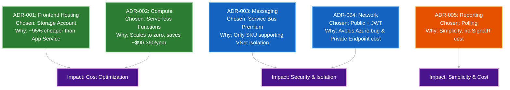
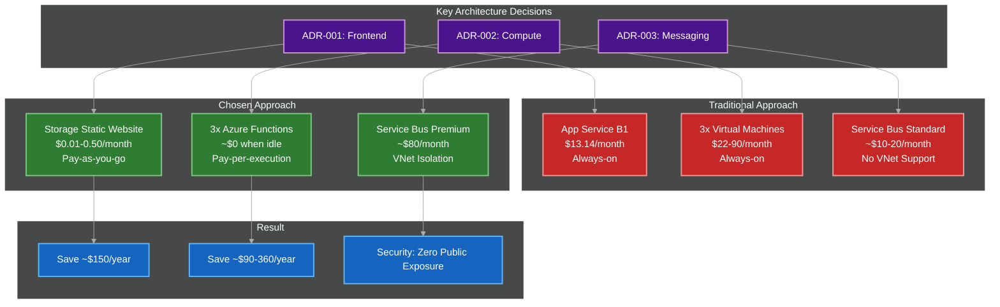

# Bravo6 — Architecture Decision Records (ADRs)

This document records the key architectural decisions made during the development of the Bravo6 platform. Each entry follows a consistent structure: the context that motivated the decision, the options considered, the choice that was made, the rationale behind it, and the consequences the platform now lives with as a result.

---

## Table of Contents

1. [Visual Overview](#visual-overview)
2. [ADR-001: Frontend Hosting — Storage Account vs. App Service](#adr-001-frontend-hosting--storage-account-vs-app-service)
3. [ADR-002: Compute — Serverless Functions vs. Virtual Machines](#adr-002-compute--serverless-functions-vs-virtual-machines)
4. [ADR-003: Messaging — Service Bus Premium vs. Standard](#adr-003-messaging--service-bus-premium-vs-standard)
5. [ADR-004: Network — Rejection of Private Endpoints for Functions](#adr-004-network--rejection-of-private-endpoints-for-functions)
6. [ADR-005: Reporting — Polling vs. Push](#adr-005-reporting--polling-vs-push)
7. [Summary of Decisions](#summary-of-decisions)
8. [Visual Overview](#visual-overview)
9. [Navigation and Further Reading](#navigation-and-further-reading)

---

## Visual Overview

### Decision Impact Map

This diagram groups each decision by the primary outcome it optimises for: cost, security and isolation, or architectural simplicity.

### Cost and Security Trade-offs

This diagram compares the traditional approach against the chosen approach for the three most consequential decisions in the platform: frontend hosting, compute, and messaging.

## ADR-001: Frontend Hosting — Storage Account vs. App Service

### Context

The platform requires hosting for a React single-page application. The frontend consists only of static files — HTML, CSS, and JavaScript. No server-side rendering or backend logic is required at the edge.

### Options Considered

| Option | Description |
|---|---|
| A. Azure App Service (B1, Linux) | A fully managed compute platform with continuous deployment support |
| B. Azure Storage Account Static Website | A blob storage container configured to serve static content over HTTP |
| C. Azure Static Web Apps | A dedicated service for static apps with integrated serverless APIs |

### Decision

**Chosen: B — Azure Storage Account Static Website**

### Rationale

- **Cost:** App Service (B1) costs approximately $13/month, fixed, whereas a Storage static website costs approximately $0.01–$0.50/month, pay-as-you-go — a saving of roughly $150/year.
- **Scaling:** Storage scales automatically with no configuration, while the Basic tier of App Service requires manual scaling.
- **Simplicity:** The React app is purely static; introducing a compute layer would add unnecessary maintenance overhead (OS patches, runtime updates) with no corresponding benefit.
- **Budget alignment:** This choice keeps the platform comfortably within the Azure for Students free-credit limits.

### Consequences

The frontend cannot perform server-side logic or API proxying. Every dynamic request must go directly to the API Function.

---

## ADR-002: Compute — Serverless Functions vs. Virtual Machines

### Context

The platform executes security scans that run for approximately 30 seconds. These scans are triggered by user requests and are expected to be sporadic rather than continuous.

### Options Considered

| Option | Description |
|---|---|
| A. Virtual Machines (B1s, Linux) | Always-on compute with a fixed monthly cost |
| B. Azure Functions (Flex Consumption) | Event-driven, pay-per-execution compute |

### Decision

**Chosen: B — Azure Functions (Flex Consumption)**

### Rationale

- **Cost efficiency:** Virtual machines are billed 24/7 regardless of usage (~$7.59–$30/month). Functions scale to zero when idle, costing roughly $0/month within the free grant of 100,000 GB-seconds.
- **Maintenance:** Functions are fully managed by Azure; there is no OS patching, security updates, or monitoring infrastructure to maintain.
- **Scaling:** Functions scale out automatically under load and back to zero when idle, which matches the sporadic nature of security scans exactly.
- **Annual saving:** Roughly $90–$360/year compared to running three always-on virtual machines.

### Consequences

Execution time is bounded by the function timeout, which can be configured up to 30 minutes on the Flex Consumption plan. Cold starts may add a small delay for infrequent requests; this is mitigated in the Worker's case by the queue trigger model.

---

## ADR-003: Messaging — Service Bus Premium vs. Standard

### Context

The platform requires a message queue to decouple the API (producer) from the Worker (consumer). All backend services must remain inaccessible from the public internet.

### Options Considered

| Option | Description |
|---|---|
| A. Service Bus Standard | Lower cost; supports basic queues and topics |
| B. Service Bus Premium | Higher cost; supports VNet service endpoints, dedicated resources, and higher throughput |

### Decision

**Chosen: B — Service Bus Premium**

### Rationale

- **VNet isolation:** Service Bus Standard does not support VNet service endpoints. Premium is the only SKU that allows `default_action = Deny` while restricting access exclusively to the VNet subnet (`10.0.1.0/24`).
- **Security:** This is a non-negotiable requirement of the platform's zero-trust network design — the queue must never be exposed to the public internet.
- **Cost trade-off:** Premium costs approximately $80/month, which is treated as the direct price of genuine network isolation rather than an avoidable expense.

### Consequences

This is the single highest-cost component in the entire architecture, at roughly $80/month. In exchange, it enables strict network policies and reliable, high-throughput messaging between the API and Worker.

---

## ADR-004: Network — Rejection of Private Endpoints for Functions

### Context

To further reduce the public exposure of the API and Report functions, Private Endpoints were considered as a way to remove their public network path entirely.

### Options Considered

| Option | Description |
|---|---|
| A. Use Private Endpoints for the API and Report Functions | Removes public network access entirely, requiring a reverse proxy for browser access |
| B. Keep the API and Report Functions publicly accessible, protected by JWT authentication | Retains a direct public HTTP path, secured at the application layer |

### Decision

**Chosen: B — Keep public, secured with JWT**

### Rationale

- **Known platform issue:** Microsoft has a documented issue (GitHub issue #2635, October 2025) where combining VNet integration (outbound) with Private Endpoints (inbound) on Flex Consumption Function Apps causes deployment failures.
- **Cost:** Private Endpoints cost approximately $7.20/month each; two endpoints would add roughly $14.40/month.
- **Architectural fit:** The browser must reach the API and Report endpoints directly. Private Endpoints would require a reverse proxy layer such as Application Gateway or API Management to bridge the public internet to a private IP, adding significant cost and operational complexity for a marginal security gain.
- **Sufficient security already in place:** JWT validation at the application layer, combined with strict network isolation of Service Bus and Cosmos DB, already provides a strong security posture for these two endpoints.

### Consequences

The API and Report endpoints remain publicly accessible but are protected by JWT authentication. The Worker Function remains completely isolated, with `public_network_access_enabled = false`.

---

## ADR-005: Reporting — Polling vs. Push

### Context

The Worker takes approximately 30 seconds to execute a scan. The frontend needs a way to know when the scan is complete so it can display the results.

### Options Considered

| Option | Description |
|---|---|
| A. Frontend polling | The frontend requests scan status from the Report Function every 2 seconds |
| B. Push-based delivery (SignalR / WebSockets) | The server pushes the result to the client as soon as the scan completes |

### Decision

**Chosen: A — Frontend polling (pull-based)**

### Rationale

- **Simplicity:** Polling requires no persistent connections, no connection-state management, and no additional Azure service.
- **Cost:** SignalR or a WebSocket-based approach would introduce a fixed cost for persistent connections and additional infrastructure to operate.
- **Clean separation of concerns:** The Report Function acts as a dedicated, read-only endpoint over Cosmos DB, keeping the write path (API and Worker) and the read path (Report) cleanly separated.
- **Adequate user experience:** A 2-second polling interval feels close to instantaneous to the user and places minimal load on Cosmos DB — the Free Tier's 400 RU/s comfortably supports this pattern at the platform's current scale.

### Consequences

The frontend is responsible for implementing and managing the polling loop. If traffic grows substantially, polling will increase Cosmos DB request unit consumption; this is monitorable and can be optimised later without a change to the overall architecture.

---

## Summary of Decisions

| ADR | Decision | Key Driver |
|---|---|---|
| ADR-001 | Storage Account static website for frontend hosting | Cost — approximately $150/year saved |
| ADR-002 | Azure Functions (Flex Consumption) for compute | Cost (~$90–$360/year saved) and zero maintenance overhead |
| ADR-003 | Service Bus Premium for messaging | VNet isolation — non-negotiable for the platform's security model |
| ADR-004 | No Private Endpoints for the API and Report Functions | Avoids a known Azure platform issue and ~$14/month in additional cost |
| ADR-005 | Frontend polling for status reporting | Simplicity and cost — no SignalR infrastructure required |

---

## Navigation and Further Reading

| Area of Focus | Document |
|---|---|
| Full architecture reference | [Azure Architecture Overview](./architecture-overview.md) |
| Infrastructure as Code (Terraform modules and resources) | [Terraform Infrastructure README](./infrastructure.md) |
| Step-by-step request and processing flow | [Data Flow and Sequence Diagram](./data-flow.md) |
| IAM, managed identities, and RBAC | [Security and Identity Model](./security-identity.md) |
| Cost optimisation and FinOps | [Cost Breakdown and FinOps Analysis](./cost-finops.md) |