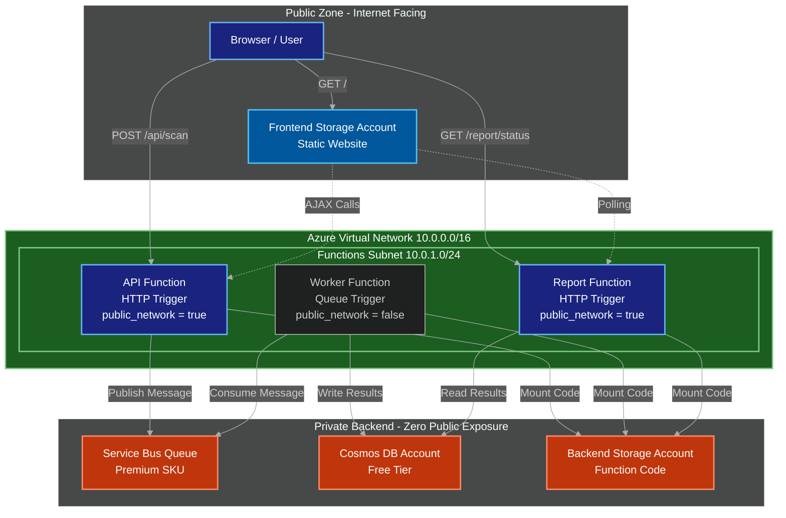
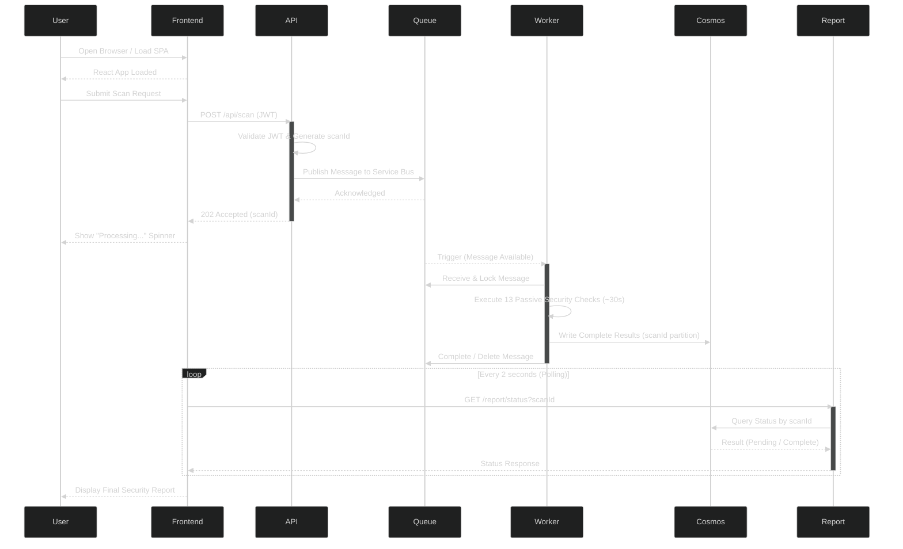
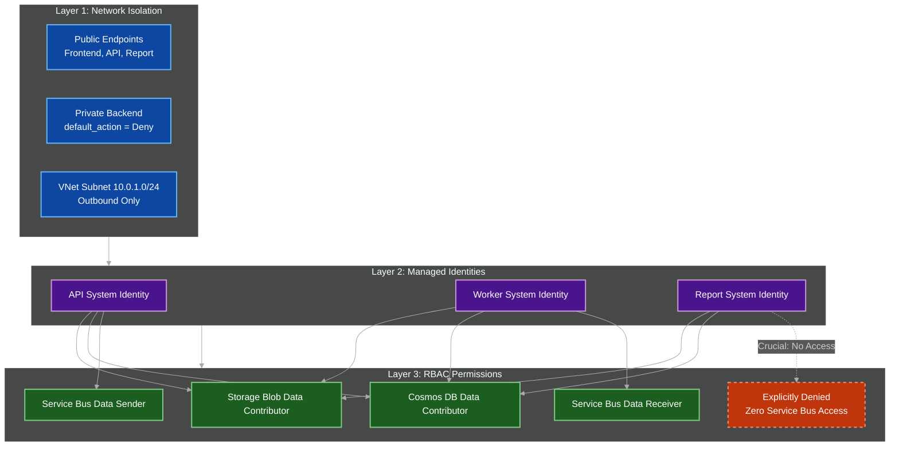

# Bravo6 — Azure Architecture Overview (Full Reference)

This document is the single, authoritative reference for the Bravo6 platform's cloud architecture on Microsoft Azure. It maps every service, every data flow, every security boundary, and every cost driver in one place, and links out to the dedicated deep-dive documents for teams that need more detail in a specific area. Anyone joining the project — engineering, security, or FinOps — should start here before moving to the specialised documents.

---

## Table of Contents

1. [Executive Summary](#1-executive-summary)
2. [High-Level Topology — The Three-Zone Model](#2-high-level-topology--the-three-zone-model)
3. [Complete Resource Inventory](#3-complete-resource-inventory)
4. [Temporal Data Flow — The Asynchronous Scan Lifecycle](#4-temporal-data-flow--the-asynchronous-scan-lifecycle)
5. [Security and Identity Matrix — Zero Secrets, Zero Trust](#5-security-and-identity-matrix--zero-secrets-zero-trust)
6. [Network Design in Depth](#6-network-design-in-depth)
7. [Master Component Reference Table](#7-master-component-reference-table)
8. [Cost Profile Summary](#8-cost-profile-summary)
9. [Scalability and Resilience](#9-scalability-and-resilience)
10. [Observability and Monitoring](#10-observability-and-monitoring)
11. [Deployment Model](#11-deployment-model)
12. [Architecture Decision Records — Snapshot](#12-architecture-decision-records--snapshot)
13. [Glossary](#13-glossary)
14. [Navigation and Further Reading](#14-navigation-and-further-reading)
15. [Summary](#15-summary)

---

## 1. Executive Summary

Bravo6 is a cloud-native, serverless SaaS security scanning platform running entirely on Microsoft Azure. A user submits a target through a React frontend; an API function authenticates the request and queues a scan job; a worker function executes the scan asynchronously; and a report function exposes the result over a polling endpoint. The platform is designed around three non-negotiable properties:

- **Zero trust between services** — every call between components is authenticated through Azure AD-backed managed identities, never through shared secrets.
- **Zero public exposure of the data plane** — Cosmos DB, Service Bus, and the backend storage account all deny public network access by default, and are reachable only from within the platform's own Virtual Network.
- **Zero idle cost wherever possible** — every compute component is serverless and billed per execution, and the only fixed-cost service in the platform (Service Bus Premium) exists purely because it is the sole SKU that supports the required network isolation.

The entire environment is defined as Terraform code and is reproducible from a single `terraform apply`, with no manual configuration steps and no configuration drift between environments.

---

## 2. High-Level Topology — The Three-Zone Model

The infrastructure is physically and logically divided into three distinct zones: **Public** (user-facing), **Compute** (VNet-integrated), and **Private** (fully isolated). This separation ensures that even if the frontend or a public-facing function were compromised, the backend data plane remains unreachable.

**Zone definitions:**

| Zone | Contains | Reachable From |
|---|---|---|
| Public | Frontend static website, API function, Report function | The public internet, over HTTPS only |
| Compute | API, Worker, and Report function runtimes, integrated into the Functions Subnet | Outbound-only from the subnet into the private zone; the Worker accepts no inbound public traffic at all |
| Private | Service Bus namespace, Cosmos DB account, backend storage account | Only the Functions Subnet, via service endpoints; `default_action = Deny` for every resource in this zone |

For the exact Terraform resources behind this topology, see the [Terraform Infrastructure README](./README.md), in particular the Resource Dependency Graph section.

---

## 3. Complete Resource Inventory

This table maps every Terraform module to the Azure resources it provisions, giving a single-page inventory of the entire platform.

| Terraform Module | Azure Resource(s) Provisioned | Zone |
|---|---|---|
| `resource_group` | Resource group `bravo6-rg`, scoping every other resource | N/A |
| `network` | Virtual Network (`10.0.0.0/16`), Functions Subnet (`10.0.1.0/24`), Network Security Group, subnet-NSG association, service endpoints for Storage and Cosmos DB | Compute boundary |
| `storage_account` | Backend Storage Account (private) and its `api-deploy`, `worker-deploy`, and `report-deploy` containers | Private |
| `frontend_stg` | Frontend Storage Account with static website hosting, Azure Front Door profile, origin group, origin, endpoint, and route | Public |
| `cosmos_db` | Cosmos DB account (Free Tier), SQL database, and the `scans` and `users` containers | Private |
| `service_bus` | Service Bus namespace (Premium SKU, network rules set to Deny) and the processing queue | Private |
| `functions_plan` | Shared Flex Consumption (FC1) Linux Service Plan used by all three function apps | Compute |
| `api_function` | API Function App (Flex Consumption); public HTTP trigger; Service Bus sender | Public / Compute |
| `function_app` | Worker Function App (Flex Consumption); private; queue-triggered; Service Bus receiver | Compute |
| `report_function` | Report Function App (Flex Consumption); public HTTP trigger; read-only reporting | Public / Compute |
| `iam.tf` (root) | All `azurerm_role_assignment` and `azurerm_cosmosdb_sql_role_assignment` bindings for the three function identities | Cross-cutting |

Globally unique resource names (storage accounts, Cosmos DB account, Service Bus namespace) are derived from a single `random_string` and `random_integer` suffix generated once at the root module and propagated to every child module that needs it, guaranteeing consistent, collision-free naming without hardcoded environment values.

---

## 4. Temporal Data Flow — The Asynchronous Scan Lifecycle

This diagram illustrates the exact sequence of events from the moment a user submits a scan to the moment results are displayed. The critical design point is the decoupling between request and processing: the API returns `202 Accepted` in under 500ms, while the Worker processes the heavier, roughly 30-second checks entirely in the background.

**Why this shape was chosen over the obvious alternatives:**

| Alternative Considered | Why It Was Rejected |
|---|---|
| Synchronous HTTP request that blocks until the scan finishes | A ~30-second scan would risk client and load-balancer timeouts, and would tie up an HTTP connection for the entire duration |
| Direct HTTP call from API to Worker | Reintroduces tight coupling and a single point of failure; a queue lets the Worker fail and retry independently of the API |
| WebSockets or SignalR for live status push | Adds a stateful, persistent-connection component to an otherwise fully stateless, serverless platform, increasing cost and operational surface for a marginal UX gain |

For performance tuning and potential optimisations such as parallelising the security checks, see the [Data Flow and Sequence Diagram](./DATA_FLOW.md) document.

---

## 5. Security and Identity Matrix — Zero Secrets, Zero Trust

Security is enforced in layers: **network** (VNet and service endpoints), **identity** (managed identities), and **permissions** (RBAC). The central design decision is least privilege: the Report Function has explicitly zero permissions on Service Bus, neutralising an entire class of attack against the messaging layer.

**Layered defence summary:**

| Layer | Control | Failure Mode It Prevents |
|---|---|---|
| Network | `default_action = Deny` plus service endpoints on Storage, Cosmos DB, and Service Bus | Direct internet access to the data plane, even with valid credentials |
| Identity | System-assigned managed identity per function; no connection strings anywhere | Credential leakage through code, configuration, or environment variables |
| Permissions | Scoped RBAC role assignments per identity, defined centrally in `iam.tf` | Lateral movement — a compromised identity cannot use permissions it was never granted |

For the exact `iam.tf` definitions and the full justification behind the least-privilege model, see the [Security and Identity Model](./SECURITY_IDENTITY.md) document.

---

## 6. Network Design in Depth

| Element | Value / Setting | Purpose |
|---|---|---|
| Virtual Network | `10.0.0.0/16` | Address space containing all VNet-integrated resources |
| Functions Subnet | `10.0.1.0/24` | Hosts the outbound VNet integration for all three function apps |
| Network Security Group | Attached to the Functions Subnet | Restricts traffic in and out of the subnet |
| Service Endpoint — Storage | `Microsoft.Storage` | Allows the subnet to reach the backend storage account without traversing the public internet |
| Service Endpoint — Cosmos DB | `Microsoft.AzureCosmosDB` | Allows the subnet to reach Cosmos DB without traversing the public internet |
| Service Bus network rules | `default_action = Deny`, Premium SKU | Restricts the queue to callers within the approved network path |

**Public versus private surface at a glance:**

| Public Surface | Private Surface |
|---|---|
| Frontend static website (via Azure Front Door) | Backend Storage Account (function code) |
| API Function (`POST /api/scan`) | Cosmos DB account (`scans`, `users` containers) |
| Report Function (`GET /report/status`) | Service Bus namespace and queue |
| — | Worker Function (queue-triggered, no public endpoint) |

No component on the private surface accepts a direct inbound connection from outside the Virtual Network under any circumstance.

---

## 7. Master Component Reference Table

| Component | Azure Service | Public Access | VNet Integration | Managed Identity | Service Bus Permission | Cost Profile |
|---|---|---|---|---|---|---|
| Frontend | Storage Account (Static Website) | Allowed | Not applicable | Not applicable | Not applicable | ~$0.01–$0.50/mo |
| API | Function App (HTTP) | Allowed | Outbound | System-assigned | Sender | Pay-per-execution (~$0 idle) |
| Worker | Function App (Queue) | Denied | Outbound | System-assigned | Receiver | Pay-per-execution (~$0 idle) |
| Report | Function App (HTTP) | Allowed | Outbound | System-assigned | No access (explicit) | Pay-per-execution (~$0 idle) |
| Message queue | Service Bus (Premium) | Denied | Inbound (service endpoints) | Not applicable | Not applicable | ~$80/mo (required for VNet isolation) |
| Data store | Cosmos DB (NoSQL) | Denied | Inbound (service endpoints) | Not applicable | Not applicable | $0 (Free Tier) |
| Code store | Storage Account (Blob) | Denied | Inbound (service endpoints) | Not applicable | Not applicable | ~$0.01–$0.50/mo |

---

## 8. Cost Profile Summary

| Scenario | Monthly Cost | Annual Cost |
|---|---|---|
| Current architecture, with Service Bus Premium | ~$80–$81 | ~$960–$972 |
| Current architecture, without Service Bus (hypothetical) | ~$0.02–$1.00 | ~$0.24–$12 |
| Traditional equivalent (App Service + VMs + API Management + CDN + Private Endpoints) | ~$200–$300 | ~$2,400–$3,600 |

The single largest cost driver in the platform is the Service Bus Premium namespace, at roughly $80/month. It is retained specifically because it is the only Service Bus SKU that supports VNet service endpoints; every other cost in the platform is either near-zero or fully consumption-based. A full breakdown of every trade-off, including the frontend hosting and compute comparisons, is available in the [Cost Breakdown and FinOps Analysis](./COST_FINOPS.md) document.

---

## 9. Scalability and Resilience

| Component | Scaling Behaviour | Resilience Notes |
|---|---|---|
| API, Worker, and Report Functions | Flex Consumption plan scales out automatically under load and scales to zero when idle | Stateless by design; any instance can serve any request, so instance loss has no data impact |
| Cosmos DB | Free Tier provides 400 RU/s and 25 GB storage; can be upgraded to provisioned or autoscale throughput as load grows | Data is partitioned by `scanId`, allowing horizontal read/write distribution as volume increases |
| Service Bus | Premium SKU provides dedicated messaging capacity and predictable throughput | Guarantees message durability and at-least-once delivery between the API and Worker |
| Frontend Storage | Static website hosting scales automatically to very high request volumes with no configuration | Served through Azure Front Door for edge caching and resilience against origin issues |

The asynchronous, queue-based design is itself a resilience mechanism: if the Worker is temporarily unavailable or overloaded, messages remain safely on the Service Bus queue until they can be processed, rather than being dropped or timing out at the API layer.

---

## 10. Observability and Monitoring

| Signal | Source | Purpose |
|---|---|---|
| Azure Activity Log | Subscription / resource group | Tracks every infrastructure change across all resources |
| Function App logs and execution metrics | API, Worker, Report Function Apps | Debugging, latency tracking, and execution-time analysis |
| Cosmos DB metrics | Cosmos DB account | Request unit consumption and query performance |
| Azure AD sign-in and token logs | Azure AD | Authentication events and managed identity token issuance |
| Service Bus metrics | Service Bus namespace | Queue depth, message age, and throughput |

These signals collectively make every layer of the platform — infrastructure changes, application behaviour, data access, and authentication — auditable after the fact, not just observable in real time.

---

## 11. Deployment Model

The entire platform is defined as Terraform code across a root module and ten child modules (see [Section 3](#3-complete-resource-inventory)). There is no manual provisioning step anywhere in the lifecycle:

1. `terraform init` — initialises providers and the remote state backend.
2. `terraform plan` — produces a full, reviewable diff of every resource to be created, changed, or destroyed.
3. `terraform apply` — provisions the entire environment, including networking, identities, role assignments, and all data and compute resources, in a single run.
4. `terraform destroy` — tears the environment down completely, leaving no orphaned resources.

Because naming, networking, and access control are all generated from code rather than configured by hand, every environment built from this codebase is identical by construction, eliminating configuration drift between deployments.

---

## 12. Architecture Decision Records — Snapshot

| Decision | Why It Was Chosen |
|---|---|
| Frontend on Storage rather than App Service | Roughly 95 percent cheaper (~$13/month saved), scales automatically, and is a natural fit for a static React SPA. |
| Serverless Functions rather than virtual machines | Scales to zero when idle; saves roughly $23–$90/month compared to always-on VMs. |
| Service Bus Premium rather than Standard | The only SKU that supports VNet service endpoints; non-negotiable given the requirement for zero public exposure of the queue. |
| Report Function with no Service Bus access | Enforces least privilege directly: even if the Report endpoint were compromised, the attacker could not read from or write to the message queue. |
| Polling rather than WebSockets or SignalR | Keeps the infrastructure stateless and inexpensive; avoids the cost and complexity of maintaining persistent connections. |
| Centralised `iam.tf` rather than per-module role assignments | Keeps the entire access model auditable from a single file instead of scattered across ten modules. |
| Shared random suffix generated once at the root | Guarantees globally unique Azure resource names without hardcoding environment-specific values in any module. |

---

## 13. Glossary

| Term | Meaning in This Platform |
|---|---|
| Managed Identity | An Azure AD identity automatically created for and tied to a specific resource (here, a Function App), used to authenticate to other Azure services without stored credentials |
| RBAC | Role-Based Access Control; the Azure mechanism used to grant scoped permissions to identities against specific resources |
| Flex Consumption | The Azure Functions hosting plan used here; billed per execution and scales to zero when idle |
| Service Endpoint | An Azure networking feature that extends a Virtual Network's identity to a specific Azure service, allowing that service to restrict access to the VNet without a Private Endpoint |
| `scanId` | The unique identifier generated by the API Function for each scan request, used as the Cosmos DB partition key and the correlation key across the API, Worker, and Report Functions |
| Least Privilege | The security principle applied throughout this platform whereby every identity is granted only the specific permissions its function requires, and nothing more |

---

## 14. Navigation and Further Reading

This document is the entry point into the Bravo6 architecture. Use the table below to jump to the document relevant to your area of focus.

| Area of Focus | Document |
|---|---|
| Infrastructure as Code (Terraform modules and resources) | [Terraform Infrastructure README](./README.md) |
| Step-by-step request and processing flow | [Data Flow and Sequence Diagram](./DATA_FLOW.md) |
| IAM, managed identities, and RBAC | [Security and Identity Model](./SECURITY_IDENTITY.md) |
| Cost optimisation and FinOps | [Cost Breakdown and FinOps Analysis](./COST_FINOPS.md) |

---

## 15. Summary

The Bravo6 architecture is a production-grade, serverless, zero-trust platform built entirely on Azure. Its defining characteristics are:

- **Logical zoning** (Public, Compute, Private) that contains the blast radius of any single compromised component.
- **Fully asynchronous messaging** that keeps the user interface responsive even while a scan takes roughly 30 seconds to complete.
- **Managed identities combined with explicit least privilege**, most notably the Report Function's complete lack of access to Service Bus.
- **Network isolation by default**, with every data-plane resource denying public access and reachable only through the platform's own Virtual Network.
- **Cost-first engineering**, using free tiers and consumption-based billing to save an estimated $1,400 or more per year compared to a traditional IaaS or PaaS setup.
- **Fully reproducible infrastructure**, provisioned end-to-end through Terraform with no manual steps and no configuration drift.

Together, these properties make Bravo6 a complete, self-contained reference architecture for building a secure, cost-conscious, serverless SaaS platform on Microsoft Azure from the ground up.