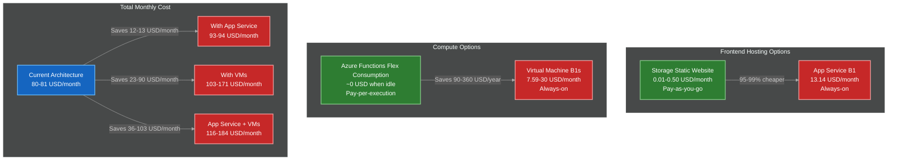

# Bravo6 — Cost Breakdown and FinOps Analysis

This document provides a detailed cost analysis for the Bravo6 platform on Microsoft Azure. It explains the reasoning behind every cost-related architectural decision, compares each choice against its alternative, and shows why the current design is the most cost-effective option available, particularly when run under the Azure for Students program.

---

## Table of Contents

1. [Azure for Students — The Foundation](#azure-for-students--the-foundation)
2. [Frontend Hosting: App Service vs Storage Static Website](#frontend-hosting-app-service-vs-storage-static-website)
3. [Compute: Virtual Machines vs Serverless Functions](#compute-virtual-machines-vs-serverless-functions)
4. [Total Cost Breakdown](#total-cost-breakdown)
5. [Cost Optimisation Overview](#cost-optimisation-overview)
6. [Summary of Cost-Saving Decisions](#summary-of-cost-saving-decisions)
7. [FinOps Principles Applied](#finops-principles-applied)
8. [Ownership and Responsibility](#ownership-and-responsibility)
9. [Conclusion](#conclusion)

---

## Azure for Students — The Foundation

The Bravo6 platform is deliberately architected to run within the limits of the Azure for Students program, maximising the value of the available credits before any paid service is considered.

| Benefit | Details |
|---|---|
| Free credit | $100 USD for 12 months |
| Free services | Access to more than 25 free services across compute, network, storage, and databases |
| No credit card required | Sign-up is possible with a verified institutional email address only |
| Free VM hours | 750 hours per month of B1-series Linux virtual machines |

Every architectural decision described in this document is made with the goal of staying within, or as close as possible to, these free-tier limits.

---

## Frontend Hosting: App Service vs Storage Static Website

### Option A — App Service (B1, Linux)

| Metric | Value |
|---|---|
| Monthly cost | ~$13.14 (fixed) |
| vCPU | 1 core |
| RAM | 1.75 GB |
| Storage | 10 GB |
| Billing model | Always-on — cost is incurred even when idle |
| Scaling | Manual only (Basic tier) |

### Option B — Storage Account Static Website (Chosen)

| Metric | Value |
|---|---|
| Monthly cost | ~$0.01–$0.50 (storage and bandwidth only) |
| Compute | Not applicable — no compute resources involved |
| Storage | Pay only for what is stored (~$0.02/GB/month, Hot tier) |
| Billing model | Pay-as-you-go — no fixed cost |
| Scaling | Automatic — handles very high traffic without configuration |

### Comparison

| Comparison | App Service (B1) | Storage Static Website |
|---|---|---|
| Monthly cost | $13.14 fixed | ~$0.01–$0.50 variable |
| Savings with Storage | — | ~95–99% cheaper |
| Cost while idle | Yes | No |
| Automatic scaling | No (Basic tier) | Yes |

For a student project with moderate traffic, this represents a difference of roughly $13/month versus under $1/month, or a saving of over $150 per year.

**Rationale:**

1. The frontend is a React single-page application — static HTML, CSS, and JavaScript files only.
2. No server-side logic is required; all logic runs in the browser or is delegated to the API.
3. A Storage Account static website scales automatically with no configuration.
4. The near-zero cost preserves student credit for services that genuinely require compute.

---

## Compute: Virtual Machines vs Serverless Functions

### Option A — Virtual Machine (B1s, Linux)

| Metric | Value |
|---|---|
| Monthly cost | ~$7.59–$30 (region and OS dependent) |
| vCPU | 1 core (burstable) |
| RAM | 1 GB |
| Billing model | Always-on — billed 24/7 regardless of usage |
| Maintenance | OS patching, security updates, and monitoring are all manual |
| Scaling | Manual — additional VMs must be provisioned by hand |
| Free tier | 750 hours/month included under Azure for Students |

### Option B — Azure Functions, Flex Consumption (Chosen)

| Metric | Value |
|---|---|
| Monthly cost | ~$0 when idle (pay-per-execution) |
| Compute | Billed only for actual execution time |
| Billing model | Pay-as-you-go — no fixed cost |
| Maintenance | None — Microsoft manages the underlying infrastructure |
| Scaling | Automatic — scales to zero when idle, scales out under load |
| Free tier | First 100,000 GB-seconds per month included |

### Comparison by Usage Level

| Scenario | Virtual Machine (B1s) | Azure Functions (Flex Consumption) |
|---|---|---|
| Idle (0 requests/day) | $7.59–$30/month | ~$0/month |
| Light usage (100 req/day) | $7.59–$30/month | ~$0.01–$0.10/month |
| Medium usage (1,000 req/day) | $7.59–$30/month | ~$0.10–$1.00/month |
| Heavy usage (10,000 req/day) | $7.59–$30/month | ~$1.00–$10.00/month |
| Annual saving vs VM | — | $90–$360/year |

A virtual machine is billed for 24/7 compute whether it is used or not. Serverless Functions are billed only for actual usage. For a sporadic workload such as on-demand security scanning, this difference compounds significantly over a year.

**Rationale:**

1. Scanning activity is sporadic — a VM would sit idle for the majority of its uptime while still incurring cost.
2. Zero maintenance overhead — no OS patching, no manual security updates, no monitoring setup.
3. Automatic scaling absorbs traffic spikes without manual intervention.
4. The monthly free grant of 100,000 GB-seconds covers the expected workload for this platform.
5. Credits saved on compute (~$7.59–$30/month) remain available for other services.

---

## Total Cost Breakdown

### Current Architecture (Optimised)

| Component | Service | Monthly Cost | Notes |
|---|---|---|---|
| Frontend hosting | Storage Account (Static Website) | ~$0.01–$0.50 | Pay only for storage and bandwidth |
| API Function | Azure Functions (Flex Consumption) | ~$0 when idle | Pay-per-execution; free tier covers most usage |
| Worker Function | Azure Functions (Flex Consumption) | ~$0 when idle | Pay-per-execution; free tier covers most usage |
| Report Function | Azure Functions (Flex Consumption) | ~$0 when idle | Pay-per-execution; free tier covers most usage |
| Message queue | Service Bus (Premium) | ~$80/month | Required for VNet isolation — non-negotiable |
| Database | Cosmos DB (Free Tier) | $0 | 400 RU/s and 25 GB free forever |
| Code storage | Storage Account (Private) | ~$0.01–$0.50 | Pay only for storage |
| Networking | VNet and Subnet | $0 | No additional charge |
| **Total (with Service Bus)** | | **~$80–$81/month** | |
| **Total (without Service Bus)** | | **~$0.02–$1.00/month** | |

### Alternative — App Service Instead of Storage

| Component | Cost | Difference |
|---|---|---|
| Frontend hosting (App Service B1) | $13.14/month | +$12.64–$13.13/month |
| Annual extra cost | — | ~$150–$157/year |

### Alternative — Virtual Machines Instead of Functions

| Component | Cost | Difference |
|---|---|---|
| API, Worker, and Report on 3 VMs | $22.77–$90/month | +$22.77–$90/month |
| Annual extra cost | — | ~$273–$1,080/year |

### Combined Alternatives

| Scenario | Monthly Cost | Annual Cost |
|---|---|---|
| Current (Optimised) | ~$80–$81 | ~$960–$972 |
| App Service + Functions | ~$93–$94 | ~$1,116–$1,128 |
| Functions + VMs | ~$103–$171 | ~$1,236–$2,052 |
| App Service + VMs (worst case) | ~$116–$184 | ~$1,392–$2,208 |

---

## Cost Optimisation Overview

---

## Summary of Cost-Saving Decisions

| Decision | Why It Saves Money | Annual Saving |
|---|---|---|
| Storage Account over App Service | No fixed monthly cost; pay only for storage and bandwidth | ~$150–$157 |
| Serverless Functions over VMs | No cost when idle; pay-per-execution | ~$273–$1,080 |
| Cosmos DB Free Tier | 400 RU/s and 25 GB free forever | ~$60–$120 |
| No API Management | Avoids a ~$50/month gateway cost | ~$600 |
| No Private Endpoints | Avoids ~$14/month and a known Flex Consumption compatibility issue | ~$168 |
| No CDN / Front Door for cost purposes | Avoids ~$20/month for CDN | ~$240 |
| Consumption-based billing | All compute scales to zero when idle | Variable |

### Total Annual Savings vs a Traditional Architecture

| Architecture | Monthly Cost | Annual Cost |
|---|---|---|
| Traditional (App Service + VMs + APIM + CDN + Private Endpoints) | ~$200–$300 | ~$2,400–$3,600 |
| Current (Optimised) | ~$80–$81 | ~$960–$972 |
| **Annual savings** | — | **~$1,400–$2,600** |

---

## FinOps Principles Applied

1. **Pay only for what is used** — serverless compute and static hosting eliminate cost for idle resources.
2. **Leverage free tiers** — Cosmos DB Free Tier, the Functions free execution grant, and student credits all reduce baseline spend.
3. **Avoid over-engineering** — no API Management, CDN, or Private Endpoints unless a concrete requirement justifies the cost.
4. **Match the service to the workload** — static content is served from Storage, not from a compute-backed App Service.
5. **Spend on security where it matters** — Service Bus Premium is the one premium service in the architecture, justified specifically by the VNet isolation requirement.

---

## Ownership and Responsibility

| Area | Responsible Party | Responsibility |
|---|---|---|
| Infrastructure cost | DevOps / Platform Team | Monitor monthly spend and identify further optimisation opportunities |
| Usage optimisation | Development Team | Write efficient code to minimise function execution time |
| Budget management | Engineering Lead / FinOps | Track spend against student credits; alert when approaching limits |
| Security cost | DevSecOps Team | Justify the cost of premium services (Service Bus) against security requirements |

---

## Conclusion

The Bravo6 platform is architected to be highly cost-effective, particularly when run under the Azure for Students program. The key decisions are:

1. Hosting the frontend on a Storage Account static website instead of App Service, saving ~$13/month (~$150/year).
2. Running compute on serverless Functions instead of virtual machines, saving ~$23–$90/month (~$273–$1,080/year).
3. Limiting the architecture to a single premium service (Service Bus), used specifically for VNet isolation and security.
4. Keeping total monthly cost at ~$80–$81 with Service Bus enabled, or ~$0.02–$1.00 without it.

The result balances security, scalability, and cost, demonstrating that a production-grade Azure platform can be built and operated within a student budget.
