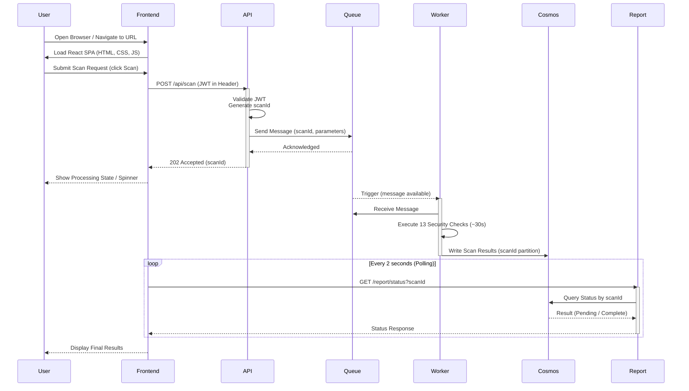

# Bravo6 — Data Flow and Sequence Diagram

This document describes the end-to-end request lifecycle for a security scan on the Bravo6 platform. The sequence diagram below shows exactly which components talk to one another, in what order, and how the asynchronous processing model keeps the user interface responsive throughout a scan.

**Status note (2026-09-12):** the diagram and steps below still show `POST /api/scan` carrying a
JWT and the API validating it, matching the target design — but the API Gateway's JWT
validation, along with its Cosmos DB scan-job write, is currently deferred out of the active
code path (see `future-work/auth/README.md`). Today, step 3 is just "check blocklist, generate
job id, enqueue" with no validation step and no Cosmos write.

---

## Table of Contents

1. [Sequence Diagram](#sequence-diagram)
2. [Step-by-Step Breakdown](#step-by-step-breakdown)
3. [Key Design Principles Illustrated](#key-design-principles-illustrated)
4. [Timing and Performance](#timing-and-performance)
5. [Security in the Data Flow](#security-in-the-data-flow)
6. [Potential Optimisations](#potential-optimisations)
7. [Summary](#summary)

---

## Sequence Diagram

The diagram below illustrates the complete flow, from the moment a user opens the frontend to the moment scan results are displayed.

---

## Step-by-Step Breakdown

| Step | Action | Details |
|---|---|---|
| 1 | User opens frontend | The browser loads the React single-page application from the public storage account. |
| 2 | User submits scan | The frontend sends a `POST /api/scan` request to the API Function with a JWT in the `Authorization` header. |
| 3 | API validates and queues | The API Function validates the JWT signature and claims, generates a unique `scanId`, and publishes a message to the Service Bus queue. |
| 4 | API returns immediately | The API responds with `202 Accepted` and the `scanId` in under 500ms; the user does not wait for the scan to complete. |
| 5 | Frontend shows a loading state | The user sees a spinner or a processing indicator while the backend works asynchronously. |
| 6 | Worker receives the message | The Worker Function is triggered by the Service Bus queue and receives the message containing the `scanId` and scan parameters. |
| 7 | Worker executes the scan | The Worker runs the 13 passive security checks, taking approximately 30 seconds. |
| 8 | Worker writes results | Once the scan completes, the Worker writes the full result set to Cosmos DB under the `scanId` partition. |
| 9 | Frontend polls for status | Every 2 seconds, the frontend sends a `GET /report/status?scanId` request to the Report Function. |
| 10 | Report queries Cosmos DB | The Report Function queries Cosmos DB for the current scan status: Pending, Running, Complete, or Failed. |
| 11 | Frontend displays results | Once the status reaches Complete, the frontend fetches the full results and displays them to the user. |

---

## Key Design Principles Illustrated

### Asynchronous Processing

- The API never waits for the Worker; the scan executes entirely in the background.
- The user is not blocked and can continue interacting with the application.
- This design avoids browser timeouts — a 30-second scan would otherwise time out a synchronous HTTP request.

### Decoupled Communication

- The API and Worker communicate exclusively through the Service Bus queue.
- No direct HTTP call exists between the API and the Worker.
- The Report Function only reads from Cosmos DB and has no direct connection to the queue.

### Polling Instead of Push

- The frontend polls the Report Function every 2 seconds.
- This avoids the operational overhead of WebSockets, SignalR, or other real-time infrastructure.
- The result is an architecture that remains simple, stateless, and cost-effective.

### Stateless Functions

- No session state is held in memory by any function.
- All state lives in Cosmos DB and is keyed by `scanId`.
- Any instance of the Report Function can serve any incoming request.

---

## Timing and Performance

| Stage | Duration | Notes |
|---|---|---|
| User loads frontend | ~1–2s | Depends on network conditions and asset size. |
| API validation and queue publish | <500ms | JWT validation and Service Bus publish are both fast operations. |
| Worker scan execution | ~30s | The dominant factor in total scan time; can be reduced by parallelising checks within the Worker. |
| Polling interval | 2s | The frontend polls at this interval until a final status is received. |
| Total user experience | ~30–35s | The user receives immediate acknowledgement, then waits roughly 30 seconds for the scan to finish. |

---

## Security in the Data Flow

| Security Control | Applied At | Details |
|---|---|---|
| JWT authentication | API Function | **Deferred (2026-09-12)** — designed for every `POST /api/scan` request, not currently enforced; see `future-work/auth/README.md`. |
| Managed identity | Worker to Cosmos DB | The Worker authenticates to Cosmos DB using its system-assigned managed identity. |
| No secrets in code | All Functions | No connection strings or access keys appear in environment variables or code. |
| VNet isolation | All backend services | Service Bus and Cosmos DB are not reachable from the public internet. |
| Least privilege | Report to Service Bus | The Report Function has no permissions on the Service Bus queue. |

---

## Potential Optimisations

| Optimisation | Description | Benefit |
|---|---|---|
| WebSocket / SignalR | Push results to the client instead of polling. | Removes unnecessary requests; near-instant updates. |
| Parallel checks | Run the 13 security checks concurrently within the Worker. | Reduces scan time from ~30s to an estimated 5–10s. |
| Caching | Cache scan results in a managed cache (Azure Cache for Redis) for frequently requested scans. | Reduces Cosmos DB request unit consumption. |
| Batch polling | Poll for multiple scan statuses within a single request. | Reduces overall network overhead. |

---

## Summary

The Bravo6 platform implements a clean, decoupled, event-driven data flow using Azure Functions, Service Bus, and Cosmos DB. The API Function publishes messages asynchronously, the Worker Function processes them independently, and the Report Function exposes a lightweight polling endpoint for the frontend. This design delivers responsiveness, scalability, and security without introducing unnecessary architectural complexity.
