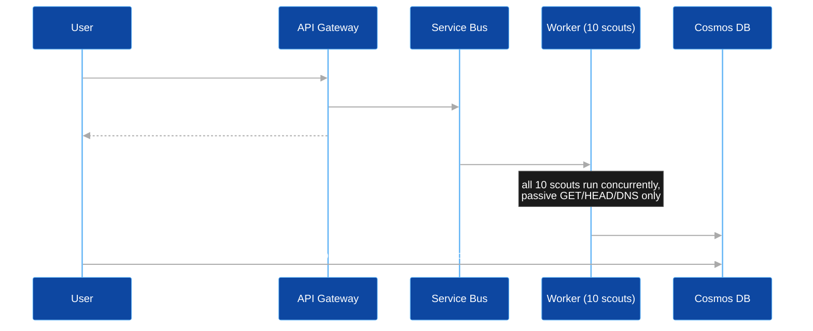

# BRAVO6

**Passive, external security scanning for sites that can't safely take an active scan.**

AI coding assistants have collapsed the time it takes to ship a working application from weeks to
hours. The security review process that's supposed to catch what shipped with it hasn't kept pace —
hardcoded secrets in auto-generated JavaScript, dependency versions pulled from stale training data,
missing security headers, CORS policies that look fine until someone exploits them. Traditional
scanners (OWASP ZAP, Burp Suite, Nikto) close that gap by attacking the target directly: injecting
payloads, brute-forcing paths, throwing thousands of signature probes at known-dangerous files. That
assumes an operator with standing authorization to test aggressively — an assumption that doesn't
hold for someone who shipped a site outside a formal security review process, or for a third party
checking a site they don't operate.

## The name

"Bravo Six, Going Dark" is the military call sign this project borrows its name from — reconnaissance
without engagement. BRAVO6 performs the same kind of pass against a web target: it gathers what's
observable without ever triggering the target's defenses, because it never sends anything a normal
browser page load wouldn't already send.

## What it actually does

Ten scouts run concurrently against a target, covering TLS/certificate health, HTTP security
headers, cookie security, CORS misconfiguration, exposed secrets, vulnerable frontend libraries,
information disclosure, email-authentication hygiene, Subresource Integrity, and a supply-chain
check for hallucinated dependencies. Every scout is read-only: `GET`, `HEAD`, `OPTIONS`, and DNS
lookups only — never a payload, never an auth-bypass attempt.

Submission and background scanning are decoupled by a Service Bus queue: the user-facing request
returns as soon as the job is durably enqueued, independent of how long the scan itself takes. See
[Software Architecture & Scouts](software-architecture.md) for how the pipeline and each scout
actually work, and the project [README](https://github.com/amramer101/Bravo6-RS#implementation-status)
for exactly which of these components are deployed versus code-complete-but-idle versus
design-only — that status varies by component and is worth reading before assuming any of this is
live.

## Access control

Submissions targeting government, military, financial-regulator, and similar sensitive-category
domains are blocked at the API Gateway before a scan is ever queued (see
`src/api/blocklist.py`) — a representative, illustrative blocklist, not an exhaustive registry.

## Why serverless

Every compute component is consumption-billed: zero cost at idle, scales out automatically under
load, no capacity planning. See [Cost & FinOps](cost-finops.md) for the actual resource-by-resource
cost model, and [Architecture Decisions](architecture-decisions.md) for the trade-offs recorded
along the way — including a Service Bus pricing correction that's as much evidence of this project's
verification discipline as it is a design footnote.

---

This documentation site, the [README](https://github.com/amramer101/Bravo6-RS), and
the accompanying paper (`main.pdf` at the repository root) are three views of the same honestly-reported
project: what's built, what's tested, what's deployed, and what's still just a design.
