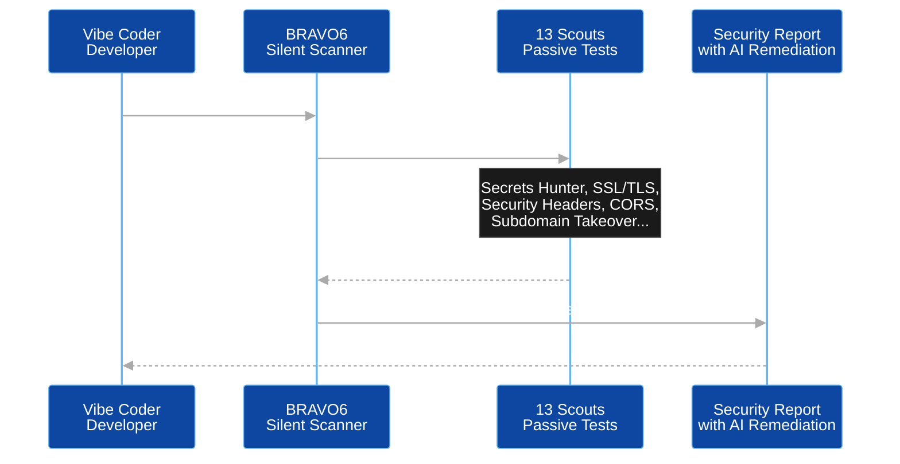

# BRAVO6 — The Silent Guardian of the AI Era

In the history of technology, every great leap in speed has demanded an equal leap in safety. Today, artificial intelligence is rewriting the rules of software creation, enabling a single developer to do the work of ten. We have entered the era of "vibe coding," where imagination is the only limit to production.

**BRAVO6 is the shield for the creators.**

It is a stealth, passive security scanner that uncovers vulnerabilities hidden in AI-generated code, without triggering alarms or sending malicious payloads.

---

## The Name: Bravo Six, Going Dark

The name is inspired by the iconic military call sign for special reconnaissance units. It represents the platform's core capability: **stealth reconnaissance**.

Just as a scout team gathers intelligence without engaging the enemy, BRAVO6 performs silent, passive scanning to uncover vulnerabilities without alerting target defences or triggering firewalls. We operate in the dark to serve the light.

---

## The Problem We Solve

The rise of AI‑assisted coding — Copilot, ChatGPT, Claude — has made developers dramatically faster. Entire applications are now scaffolded in minutes. What these tools do not solve is the security layer.

This creates a new class of vulnerability we call **AI Security Debt**:

- Hardcoded secrets embedded in auto‑generated JavaScript.
- Outdated library versions suggested from stale training data.
- Missing security headers on generated API responses.
- Misconfigured CORS policies that feel correct until an attacker exploits them.

Traditional scanners attack this problem by attacking the target — sending payloads, brute‑forcing paths, and triggering intrusion detection systems. That approach is noisy, destructive in CI/CD environments, and illegal without explicit permission.

---

## The Solution — What BRAVO6 Does

BRAVO6 is different. It is a **passive, read‑only security scanner**. It behaves exactly like a browser, sends no payloads, and triggers no alarms. It reads what is publicly visible and reports what an attacker would see, before the attacker ever sees it.

- **13 specialised tests** run in full concurrency.
- A **complete scan** of any live target finishes in approximately **30 seconds**.
- **AI‑powered remediation** provides developer‑friendly, actionable fixes (available on the Developer tier).
- **Fully serverless**, costing nothing at idle and scaling automatically to thousands of simultaneous scans.

### How a Scan Works

The diagram below shows the journey of a single scan, from the moment a developer submits a target to the moment they receive a report they can act on.

## Subscription Plans

BRAVO6 is designed to democratise cybersecurity. It is accessible to students, freelancers, and small teams, not just corporations with million‑dollar budgets.

| Feature | Free Tier | Developer Tier ($10/mo) |
|---|---|---|
| **Scouts available** | 8 scouts | **13 scouts** (full suite) |
| **Daily scan limit** | 3 scans per day | **10 scans per day** |
| **AI remediation** | Not included | ✅ Included (GPT‑4o mini) |
| **Analytics dashboard** | Not included | ✅ Included |
| **Terms of use** | Required at sign‑up | Required at sign‑up |

> **Domain awareness:** The platform maintains awareness of which domains are being targeted. Government, military, and internationally sanctioned entities are automatically blocked at the API Function's entry point before a scan is ever queued, regardless of tier.

---

## Why Serverless? The Industry Standard

The combination of serverless compute and event‑driven messaging is not a passing trend; it is the architecture that powers Netflix, Meta, Uber, and every modern cloud‑native platform at scale.

- **Zero idle cost:** BRAVO6 costs nothing when idle. Traditional servers would pay for 24 hours of computation to serve only a few hours of real work.
- **The asynchronous wall:** a security scan takes roughly 30 seconds. Instead of holding a browser connection open, the API responds in under 200ms with a tracking ID, processes the scan in the background, and the user checks back for results.
- **Infinite scale:** autoscaling spins up workers based on demand — one scan or one thousand scans, the architecture remains identical.

---

## Built to Scale Efficiently

Every component of BRAVO6 is serverless and consumption‑billed, meaning the platform incurs no cost while idle and grows cost only in proportion to real usage.

| Service Category | Used For | Cost Behaviour |
|---|---|---|
| **Static hosting** | Frontend delivery | Near‑zero; pay for storage and bandwidth only |
| **Serverless compute** | API, scanning worker, reporting | Pay‑per‑execution; zero cost when idle |
| **Message queue** | Decoupling requests from scan execution | Fixed cost, isolated from the public internet |
| **Serverless database** | Scan results storage | Pay‑per‑request; zero idle cost |
| **Secrets management** | Credentials and keys | Negligible cost |
| **Identity** | Authentication | Free for standard usage volumes |
| **Observability** | Monitoring and diagnostics | Free ingestion allowance at this scale |

---

BRAVO6 exists for one reason: the faster software gets built, the faster its blind spots get built in with it. BRAVO6 finds those blind spots before anyone else does — silently, passively, and in under thirty seconds.
