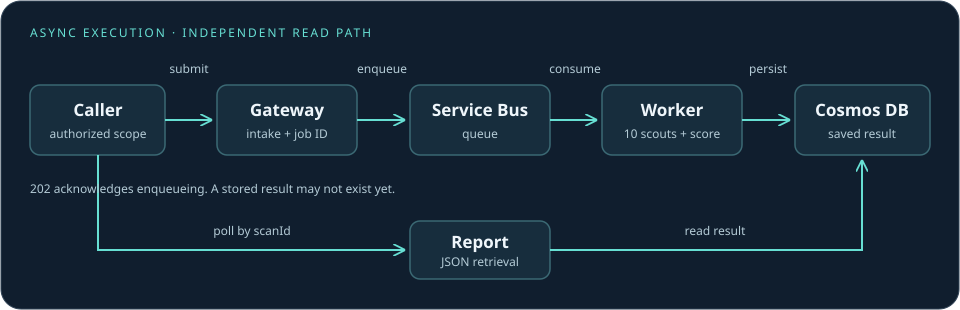

---
hide:
  - toc
---

BRAVO6 · SYSTEM & RESEARCH DOCUMENTATION

# Understand the signal. Account for the coverage.

A serverless research prototype for assessing externally observable web-security signals. Explore the implementation, the archived cloud experiment, and the limits of what the measurements establish.

[Explore the architecture](architecture-overview.md){ .md-button .md-button--primary }
[Read the evaluation](research.md){ .md-button }

Research prototype10 scoutsAll rights reserved

<strong>864</strong>submitted targets

<strong>848</strong>saved results

<strong>508</strong>representative pages

<strong>497</strong>module-complete representative results

These are nested counts from the saved September 19, 2026 experiment. “Representative” describes the response-classification flag; it does not mean representative of the entire Web. Completing a module does not mean every subcheck was evaluated.

## A system you can inspect

BRAVO6 combines HTTP observations, TLS probes, DNS queries, and package/advisory lookups behind an asynchronous Azure workflow. It emits findings and a heuristic score. Its contribution is integration and measurement practice, not a validated certificate of security.

- **01 · Understand the system**

    Follow the request lifecycle, component boundaries, and design tradeoffs.

    [Architecture →](architecture-overview.md)

- **02 · Inspect the implementation**

    Read the API contract, ten scout profiles, finding schema, and scoring rules.

    [Technical reference →](api-reference.md)

- **03 · Examine the evidence**

    Separate original scores from retrospective sensitivity analysis and coverage limits.

    [Research results →](research.md)

- **04 · Work with the repository**

    Understand setup, documentation builds, automation, and deferred capabilities.

    [Maintainer guide →](contributing.md)

!!! note "Scope of this documentation"
    The active Gateway and Report implementation has no application-layer caller authentication or result-ownership enforcement. The frontend is not implemented. Target requests require an appropriate authorization boundary. This site is documentation, not a hosted scanning service.

## Read evidence at the right level

| Label | Meaning |
| --- | --- |
| **Implemented** | Present in the inspected source; not a guarantee of correctness or current deployment |
| **Observed** | Supported by preserved experiment artifacts, within their coverage |
| **Derived** | Calculated offline from saved data, without a new target scan |
| **Deferred** | Outside the active runtime; not an evaluated capability |

[Known limitations](limitations.md) · [Ethics and data availability](ethics.md) · [Rights and citation](rights.md)
