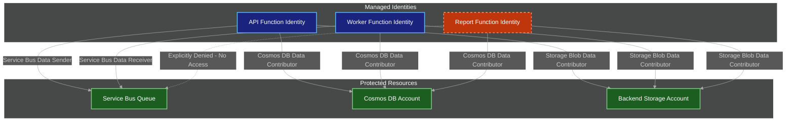
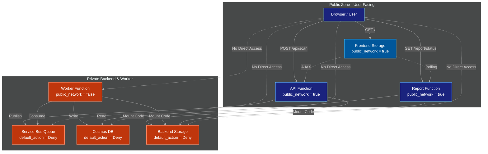

# Bravo6 — Security and Identity Model

This document provides a comprehensive overview of the security architecture and identity management for the Bravo6 platform on Microsoft Azure. It covers authentication, authorisation, network isolation, secrets management, and the principle of least privilege, all enforced through Azure-native services and defined as Infrastructure as Code.

---

## Table of Contents

1. [Security Principles](#security-principles)
2. [Authentication — Managed Identities](#authentication--managed-identities)
3. [Authorisation — Role-Based Access Control](#authorisation--role-based-access-control)
4. [Network Isolation](#network-isolation)
5. [Application Security — JWT Authentication](#application-security--jwt-authentication)
6. [Secrets Management — Azure Key Vault](#secrets-management--azure-key-vault)
7. [Compliance and Auditing](#compliance-and-auditing)
8. [Security Checklist](#security-checklist)
9. [Ownership and Responsibility](#ownership-and-responsibility)
10. [Summary](#summary)

---

## Security Principles

The Bravo6 platform is built on the following security pillars:

| Principle | Implementation |
|---|---|
| Zero trust | Every request is authenticated and authorised; no implicit trust between services |
| Least privilege | Every identity holds only the permissions it needs, and nothing more |
| Defence in depth | Multiple independent layers of security: network, identity, application, and data |
| No secrets in code | All credentials are managed by Azure and accessed exclusively through managed identities |
| Auditability | Every permission is defined in code (Terraform) and version-controlled |

---

## Authentication — Managed Identities

Every Azure Function uses a system-assigned managed identity for authentication. This removes the need for connection strings, access keys, or any other credential material in environment variables or application code.

### What a Managed Identity Provides

A managed identity is an Azure Active Directory identity that Azure automatically provisions and manages, tied to a specific resource such as a Function App. It allows that resource to authenticate to other Azure services without storing any credentials.

### How It Works

1. When a Function App is created, Azure automatically provisions a corresponding service principal in Azure AD.
2. The Function App uses this identity to obtain access tokens for any Azure service that supports Azure AD authentication — Storage, Cosmos DB, Service Bus, Key Vault, and others.
3. Access tokens are refreshed automatically by the Azure infrastructure.
4. No secret is ever stored in code, configuration files, or environment variables.

### Why Managed Identities Were Chosen

| Approach | Security | Operational Overhead | Automation |
|---|---|---|---|
| Connection strings | Weak — exposed in configuration files; leakage risk | High — requires manual key rotation | Manual |
| Manually managed service principals | Adequate but complex | High — requires manual creation, storage, and rotation of secrets | Partial |
| Managed identities (chosen) | Strongest — no secrets to manage at all | None — fully handled by Azure | Fully automated via Terraform |

A direct consequence of this model: the Report Function holds no permissions on Service Bus. If it were ever compromised, the attacker would have no ability to send or receive messages on the queue, containing the impact of the breach.

---

## Authorisation — Role-Based Access Control

Each function is granted the minimum set of permissions required to perform its role. All assignments are defined in `iam.tf` and applied automatically by Terraform.

### Role Assignment Matrix

| Function | Backend Storage | Cosmos DB | Service Bus |
|---|---|---|---|
| API | Storage Blob Data Contributor | Cosmos DB Data Contributor | Azure Service Bus Data Sender |
| Worker | Storage Blob Data Contributor | Cosmos DB Data Contributor | Azure Service Bus Data Receiver |
| Report | Storage Blob Data Contributor | Cosmos DB Data Contributor | No access — explicitly omitted |

### Rationale Behind the Matrix

- **Storage (Blob Data Contributor):** every function needs to read its own code from the backend storage container; the API and Report functions also write logs and outputs.
- **Cosmos DB (Data Contributor):** the Worker writes scan results, the Report function reads them, and the API may read user metadata.
- **Service Bus — Sender (API):** the API publishes messages to the queue and never receives from it.
- **Service Bus — Receiver (Worker):** the Worker consumes messages from the queue and never sends to it.
- **Service Bus — No access (Report):** the Report function is strictly a read-only consumer of Cosmos DB and does not interact with the queue in any capacity.

### Least Privilege in Practice

The Report Function has no permissions on Service Bus whatsoever — it cannot send, receive, peek, or manage the queue. This is the clearest expression of least privilege in the platform: even a fully compromised Report Function grants an attacker no foothold in the messaging layer.

---

## Network Isolation

All backend services are inaccessible from the public internet. Traffic reaches them only from the functions subnet (`10.0.1.0/24`) via VNet service endpoints.

### Service Endpoints Enabled

| Service | Service Endpoint | Default Action |
|---|---|---|
| Backend Storage | `Microsoft.Storage` | Deny |
| Service Bus | `Microsoft.ServiceBus` | Deny |
| Cosmos DB | `Microsoft.AzureCosmosDB` | Deny |

### Network Rules Summary

| Resource | Public Access | VNet Access | Rationale |
|---|---|---|---|
| Frontend Storage | Allowed | — | Browser must fetch static assets directly |
| API Function | Allowed | — | Browser must be able to submit scan requests |
| Report Function | Allowed | — | Browser must be able to poll for scan status |
| Worker Function | Denied | — | Triggered only by the queue; no inbound path is needed |
| Backend Storage | Denied | Subnet only | Holds function code and outputs |
| Service Bus | Denied | Subnet only | Message queue between API and Worker |
| Cosmos DB | Denied | Subnet only | Scan results and metadata |

### Architecture Diagram

---

## Application Security — JWT Authentication

All API endpoints are protected using JSON Web Token (JWT) authentication.

### Flow

1. The user authenticates through the frontend using an OAuth2 / OIDC flow (Azure AD or an external identity provider), which returns a JWT.
2. Every subsequent request to the API Function includes the JWT in the `Authorization: Bearer <token>` header.
3. The API Function validates the token's signature, expiry, and issuer.
4. If the token is valid, the request is processed and the user's identity (the `sub` claim) is used for authorisation decisions.
5. If the token is invalid, the request is rejected with `401 Unauthorized`.

### Benefits

- **Stateless:** no server-side session storage is required.
- **Scalable:** token validation is fast and requires no database lookup.
- **Standards-based:** compatible with any OIDC-compliant identity provider.
- **Auditable:** token claims carry user identity for logging and traceability.

### Key Security Properties

| Property | Implementation |
|---|---|
| Signing algorithm | RS256 (asymmetric) — a private key signs, a public key validates |
| Token expiry | Short-lived (one hour); tokens must be refreshed |
| Issuer validation | Only tokens from the configured Azure AD tenant are accepted |
| Audience validation | Tokens must be explicitly intended for the API Function |
| Scope validation | The `scp` claim is checked against required permissions |

---

## Secrets Management — Azure Key Vault

All sensitive configuration values, including database connection strings and API keys, are stored in Azure Key Vault and accessed through managed identities.

### Key Vault Usage

| Secret Type | Stored In | Accessed By |
|---|---|---|
| Cosmos DB connection string | Key Vault | API, Worker, Report (via managed identity) |
| Service Bus connection string | Key Vault | API (sender), Worker (receiver) |
| JWT signing public key | Key Vault | API Function |
| External service API keys | Key Vault | Worker Function |

### Access Pattern

1. Each Function App's managed identity is granted the `Key Vault Secrets User` role on the Key Vault.
2. At runtime, the Function App authenticates to Key Vault with its managed identity and retrieves secrets by name.
3. Secrets are cached in memory and refreshed on a periodic schedule.

### Benefits

- **Centralised management:** all secrets live in a single, secured location.
- **No secrets in code:** environment variables and configuration files hold only references to Key Vault entries.
- **Audited access:** every secret access is logged in Azure Monitor.
- **Rotatable:** secrets can be rotated without a code redeployment.

---

## Compliance and Auditing

### Logging and Monitoring

| Service | Logs / Metrics | Purpose |
|---|---|---|
| Azure Activity Log | All resource operations | Track changes to infrastructure |
| Function App logs | Application logs, execution metrics | Debugging and performance monitoring |
| Cosmos DB logs | Query performance, RU consumption | Optimise database usage |
| Key Vault logs | Secret access events | Detect unauthorised access attempts |
| Azure AD logs | Authentication events | Track logins and token issuance |

### Auditable Assets

| Asset | Where Defined | Version-Controlled |
|---|---|---|
| IAM role assignments | `iam.tf` | Yes |
| Network security rules | `network/main.tf` | Yes |
| Key Vault access policies | `keyvault/main.tf` | Yes |
| JWT validation logic | Function code (Python) | Yes — unit-tested |
| Service Bus policies | `service_bus/main.tf` | Yes |

All changes to security-relevant configuration require a pull request and are subject to review before merge.

---

## Security Checklist

| Security Requirement | Status | Implementation |
|---|---|---|
| Authentication (managed identities) | Complete | System-assigned identities on all Function Apps |
| Authorisation (RBAC) | Complete | Roles assigned in `iam.tf` following least privilege |
| Network isolation | Complete | VNet and service endpoints; `default_action = Deny` |
| Secrets management | Complete | Azure Key Vault with managed identity access |
| JWT validation | Complete | API Function validates every incoming token |
| HTTPS only | Complete | `https_only = true` on all Function Apps |
| TLS 1.2 minimum | Complete | `minimum_tls_version = "1.2"` on all services |
| No public access (backend) | Complete | `public_network_access = false` on Worker, Cosmos DB, and Service Bus |
| Public access (frontend and public APIs) | Complete | Intentionally public to allow browser access |
| Audit logging | Complete | Azure Activity Log; Application Insights planned |
| Least privilege (Service Bus) | Complete | Report Function has no permissions on the queue |

---

## Ownership and Responsibility

| Area | Responsible Party | Details |
|---|---|---|
| IAM / RBAC policies | DevOps / Platform Team | Define and apply `iam.tf`; review permissions quarterly |
| Network security | Network Engineer / DevOps | Configure VNet, NSG, and service endpoints |
| JWT implementation | Development Team | Validate tokens within the API Function code |
| Key Vault management | DevSecOps | Rotate secrets and manage access policies |
| Compliance audits | Security Lead / CISO | Review logging and access patterns periodically |

---

## Summary

The Bravo6 platform implements a defence-in-depth security model built entirely on Azure-native services:

- **Managed identities** remove the need for credentials in code.
- **RBAC with least privilege** ensures every identity holds only the permissions it requires, with the Report Function explicitly denied any access to Service Bus.
- **Network isolation** through VNet integration and service endpoints keeps all backend services out of reach of the public internet.
- **JWT authentication** secures every API endpoint.
- **Azure Key Vault** centralises and protects all secrets.
- **Auditability** is built in through version-controlled Infrastructure as Code and Azure-native monitoring.

Every security control described here is defined as code in Terraform, version-controlled, and deployable with a single command, guaranteeing consistency, repeatability, and transparency across environments.
