# Infrastructure — Bravo6 Azure Platform

> **This directory contains the complete Infrastructure as Code (IaC) for the Bravo6 platform.**  
> Every Azure resource is defined here. Nothing was clicked in the portal. Nothing was configured manually.  
> If it runs on Azure, it lives in this folder.

---

## Diagrams

### Runtime Architecture & Data Flow

.svg)

The platform follows a fully decoupled, event-driven architecture.  
The API Function receives scan requests and publishes them to the Service Bus queue.  
The Worker and Report Functions trigger independently — no direct coupling, no shared state, no blocking calls.  
All compute is serverless. All identity is Managed. All network traffic stays inside the VNet.

---

### Terraform Module Graph



Every box in this graph is a Terraform module. Every arrow is an explicit dependency.  
No implicit dependencies. No `depends_on` hacks. The graph is the architecture.  
`terraform plan` produces 29 resources from this graph — zero manual intervention required.

---

## What This Directory Provisions

| Module | Azure Resource | Purpose |
|--------|---------------|---------|
| `resource_group` | Resource Group | Logical container for all resources |
| `network` | VNet + Subnet + Service Endpoints | Private backbone — all backend traffic stays internal |
| `storage_account` | Storage Account + Container | Function code storage, blob output — VNet-restricted |
| `service_bus` | Service Bus Namespace + Queue | Async job queue — decouples API from scanning workers |
| `cosmos_db` | Cosmos DB Account + Database | Scan results & metadata — NoSQL, free tier |
| `keyvault` | Key Vault | Secret store — accessed only via Managed Identity |
| `app_service_plan` | App Service Plan (Y1) | Serverless consumption plan — pay per execution |
| `function_app` | Worker Function App | Executes 13 passive security checks |
| `api_function` | API Function App | HTTP entry point — validates & queues scan jobs |
| `report_function` | Report Function App | Aggregates findings, calls Azure OpenAI for remediation |
| `static_website` | Static Web App | React frontend — linked to API Function as backend |

**Total: 29 resources. One `terraform apply`. Zero clicks.**

---

## Security Design — Zero Credentials, Zero Trust

This infrastructure was designed with one rule: **no secret should ever touch a config file, an environment variable, or a pipeline log.**

Every function authenticates using its **System-Assigned Managed Identity**.  
Every role assignment is scoped to the minimum required permission.

```
                    ┌─────────────────────┐
                    │   Managed Identity   │
                    │  (per Function App)  │
                    └──────────┬──────────┘
                               │
          ┌────────────────────┼────────────────────┐
          ▼                    ▼                    ▼
  Storage Blob          Cosmos DB            Service Bus
  Data Contributor   Data Contributor    Sender / Receiver
  (all 3 functions)  (all 3 functions)   (role-separated)
```

**The API Function can only SEND to Service Bus. It cannot receive.**  
**The Worker and Report Functions can only RECEIVE. They cannot send.**  
**No function has more access than its job requires.**

### Role Assignment Matrix

| Function | Storage | Cosmos DB | Service Bus |
|----------|---------|-----------|-------------|
| API Function | ✅ Contributor | ✅ Contributor | ✅ **Sender only** |
| Worker Function | ✅ Contributor | ✅ Contributor | ✅ **Receiver only** |
| Report Function | ✅ Contributor | ✅ Contributor | ✅ **Receiver only** |

All RBAC assignments are in [`iam.tf`](./iam.tf) — reviewed, versioned, and auditable.

---

## Network Isolation

No backend service accepts public traffic. Period.

```
Internet
   │
   │  ✅ Allowed
   ▼
Static Web App (public by design — frontend only)
   │
   │  ✅ Allowed (Linked Backend)
   ▼
API Function ──── VNet (10.0.0.0/16)
                      │
                      │  Service Endpoints
                      ├──▶ Storage Account   (default_action = Deny)
                      ├──▶ Service Bus        (default_action = Deny)
                      ├──▶ Cosmos DB          (default_action = Deny)
                      └──▶ Key Vault          (default_action = Deny)
```

**Service Endpoints enabled:**
- `Microsoft.Storage`
- `Microsoft.AzureCosmosDB`
- `Microsoft.ServiceBus`
- `Microsoft.KeyVault`

The only traffic allowed into backend services comes from the Functions subnet (`10.0.1.0/24`). Everything else is denied at the network layer — before it even reaches the application.

---

## FinOps — Cost Decisions

Every architectural decision has a cost implication. Here's the thinking behind each one:

| Decision | Cost Impact | Reasoning |
|----------|------------|-----------|
| Consumption Plan (Y1) | ~$0 when idle | Scanning is sporadic — pay only for actual executions |
| Cosmos DB Free Tier | $0 for 400 RU/s + 25 GB | Sufficient for scan results at this scale |
| Storage LRS | Lowest tier | No geo-redundancy needed for function code storage |
| Service Bus **Premium** | ~$80/month | **Required** for VNet Service Endpoints — non-negotiable for zero-public-access design |
| `random_string` + `random_integer` suffixes | No cost | Prevents global naming collisions — avoids forced resource recreation |

**The only premium cost is the Service Bus.** It was a deliberate trade-off: pay for Premium or expose the message queue to the public internet. Security won.

---

## File Structure

```
terraform/
├── main.tf                    # Root orchestration — all modules wired here
├── iam.tf                     # All RBAC assignments in one place
├── connections.tf             # Static Web App ↔ API Function binding
├── variables.tf               # Typed, documented input variables
├── backend.tf                 # Remote state — Azure Storage + locking
├── terraform.tfvars.example   # Safe-to-commit template (no real secrets)
└── modules/
    ├── resource_group/
    ├── network/
    ├── storage_account/
    ├── service_bus/
    ├── cosmos_db/
    ├── keyvault/
    ├── app_service_plan/
    ├── function_app/
    ├── api_function/
    ├── report_function/
    └── static_website/
```

**Why one `iam.tf` for all role assignments?**  
Because access control should be visible in one place — not scattered across modules.  
When someone asks "what can this function do?", the answer is one file open, not a grep across 11 modules.

---

## How to Deploy

```bash
# Authenticate
az login

# Initialize — downloads azurerm provider, configures remote backend
terraform init

# Configure secrets — never commit the real .tfvars
cp terraform.tfvars.example terraform.tfvars

# Review — 29 resources, 0 changes to existing infra
terraform plan

# Deploy
terraform apply
```

**Output after apply:**
```
frontend_url = "https://your-app.azurestaticapps.net"
```

The platform is live. No post-deployment manual steps required.

---

## Author

**Amr Medhat Amer** — Cloud & DevSecOps Engineer  

[LinkedIn](https://linkedin.com/in/amrmamer) · [GitHub](https://github.com/amramer101)